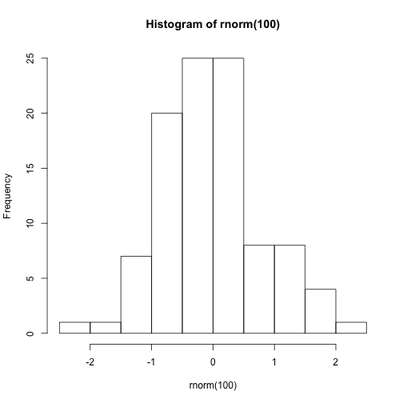

Ok, I tried a clean install of blogdown and using RStudio to create a new post. I don't plan to use RStudio for blogging in the future if I can avoid it -- it is a great R editor but I find it a bit sluggish compared to iA Writer for writing. But it supports creating new posts with `blogdown`, so it is worth trying out.

What I really am interested in is whether it handles images correct. So, here goes, will it plot this?


```r
hist(rnorm(100))
```


