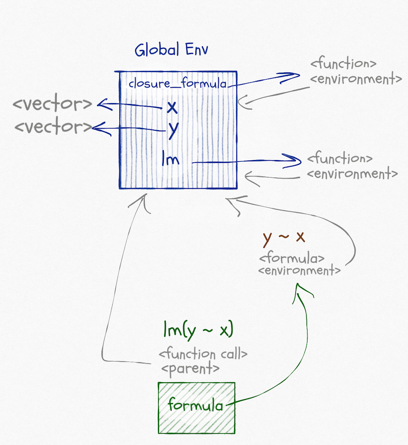
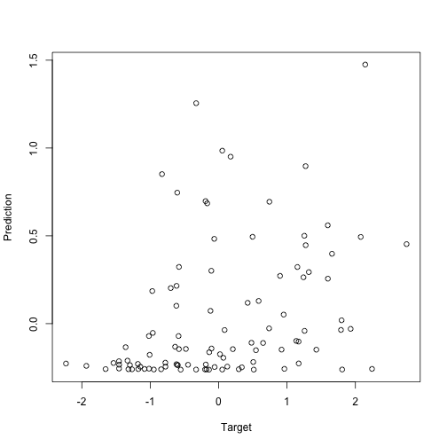
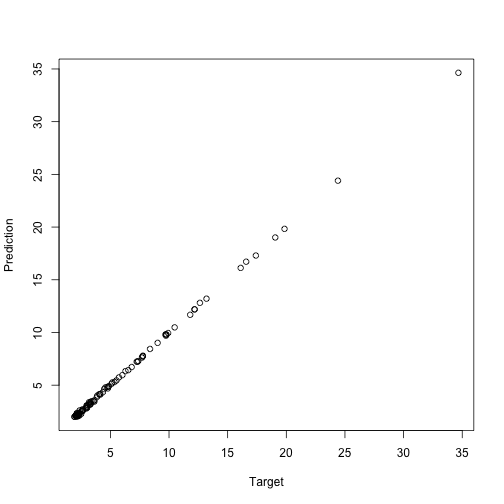
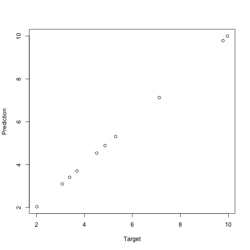

In my two previous posts on non-standard evaluation, [*Scoping rules and NSE*](https://mailund.github.io/r-programmer-blog/2018/09/20/scoping-rules-and-nse/) and [*Overscoping and eval*](https://mailund.github.io/r-programmer-blog/2018/09/22/overscoping-and-eval/), I explained:

 * How R finds the bindings of variables by looking through chains of environments.
 * How you can manipulate these environments to evaluate expressions in a non-standard way.
 * How you can evaluate expressions where lists or data-frames overscope variables that would otherwise be found in environments.
 
 I finished the last post with a model-fitting example, where the `lm` function fits data to a formula, by saying that *this* particular example had more going on than you might expect. When we write something like
 
 ```r
 lm(y ~ x, data = df)
 ```
 
it looks as if the `lm` function uses over-scoping to search for `x` and `y` in the `df` data frame first, and if that fails, it looks in the calling scope. This is something we might implement using `eval` and `parent.frame` (or the more aptly named `rlang::caller_env`). This is, in fact, not what is happening. It almost is, yes, but not quite. The `lm` function does use overscoping to put `df` in front of environments, but it does not look in the calling environment; it looks in the *formulas* environment.^[If you look at the code for `lm` you will see that it *does* evaluate am expression in the calling environment. This is to get a function to build a model frame. This is a detail and is not essential for the discussion here. I briefly discuss model matrices and model frames at the end of the post. Here, you will see that we can fit models just fine without ever looking in the caller environment.]
 
 
 ```r
 x <- rnorm(5); y <- rnorm(5)
 lm(y ~ x)
 ```
 
 ```
 ## 
 ## Call:
 ## lm(formula = y ~ x)
 ## 
 ## Coefficients:
 ## (Intercept)            x  
 ##      0.2791       0.2614
 ```
We will use this function to contrast an environment from a closure with one we create at the global scope:


```r
closure_formula <- function() {
    x <- rnorm(5); y <- rnorm(5)
    y ~ x
}
```

The graph of environments looks like this:



Functions and formulae have associated environments. They do not have their own environments the way that function *calls* have, like the one that exists when we call `lm(y ~ x)`, they are just references to other environments. The environment associated with a function is the one that will be the parent of the environment in a function call. It will be the one the function is defined in (unless you change it, which you can). The environment associated with a formula is also the one where the formula is created (unless you change it), but it is just used to find variables that are not over-scoped.

When we call `lm(y ~ x)` we create the formula `y ~ x`. Its environment is the global environment. When we call `lm` it puts the formula in its argument, `formula`, and then it fits a linear model to this formula, based on variables in `formula`'s environment. Not its own and not its caller's environment. Well, it is its caller's environment since it is called from the global environment, but that is a coincidence. It doesn't use the caller's environment to look up variables.

The formula does not store the variables it contains. If we changed `x` or `y` between creating the formula and fitting the model, we would use the new values of the variables. We only use the formula environment to get a starting point for the search for variables.

Now, contrast it with this:


```r
f <- closure_formula()
lm(f)
```

```
## 
## Call:
## lm(formula = f)
## 
## Coefficients:
## (Intercept)            x  
##      0.2621      -0.7383
```

The graph for this call looks like this, and I apologise that it is very busy. But there really is all this going on (and I haven't even included edges for caller environments).


In the call to `closure_formula`, we create a formula; the environment associated with this formula is the one we create in the function call. When we call `lm(f)` the situation is similar to before. In `lm` we will get variables from `formula`. This time that will be the formula created in the function-call scope.

If we tried fitting the model in a function that has local variables `x` and `y`, we would see that these do not overrule the ones associated with the formula:


```r
nested_fit <- function(f) {
    x <- rnorm(5); y <- rnorm(5)
    lm(f)
}
nested_fit(y ~ x)
```

```
## 
## Call:
## lm(formula = f)
## 
## Coefficients:
## (Intercept)            x  
##      0.2791       0.2614
```


```r
nested_fit(f)
```

```
## 
## Call:
## lm(formula = f)
## 
## Coefficients:
## (Intercept)            x  
##      0.2621      -0.7383
```

If we take a formula defined in the global scope, and one defined in the closure


```r
outer_f <- y ~ x
closure_f <- closure_formula()
```

we can see that the environment of the first is the global environment


```r
environment(outer_f)
```

```
## <environment: R_GlobalEnv>
```

and the other is different. It is the environment of the function call, trust me.


```r
environment(closure_f)
```

```
## <environment: 0x7f9f3dc6f590>
```

```r
ls(environment(closure_f))
```

```
## [1] "x" "y"
```

This environment contains the variables `x` and `y` because we define them inside the function call.

If you don't believe that the environment for the formula is the one from the function call—maybe you think that I am a liar—then we can check that explicitly by printing the environment inside the formula-generating function.

That would be a boring example compared to what we have already done, so I will add a twist to it. I will create the formula inside the function call but using a non-standard evaluation.


```r
closure_formula_nse <- function(f) {
    a <- rnorm(5); b <- rnorm(5)
    print(environment())
    eval(substitute(f))
}
```

The `eval(substitute(f))` makes the argument `f` into a quoted expression and then evaluates it. We lose the environment associated with the arguent^[Yes, arguments have a scope. I will return to that in a different post.] but create a formula based on it inside the function call scope.


```r
closure_f <- closure_formula_nse(y ~ x)
```

```
## <environment: 0x7f9f40634588>
```

```r
environment(closure_f)
```

```
## <environment: 0x7f9f40634588>
```

```r
ls(environment(closure_f))
```

```
## [1] "a" "b" "f"
```

## Exploiting the closure-ness of formulae

You can exploit that formulae carry environments with them. They capture the closure where they are defined in the same way that functions do, and you can get that environment using the `environment` function.^[You can also create formulae where you get to pick the environment if you use the `as.formula` function. It allows you to provide an environment as an argument.]

The `rlang` package exploits this to implement quasi-quotations for tidyeval. 

You can exploit the formula+environment combination in other ways. For example, `purrr` uses formulas to make lambda expressions. This functionality involves translating a formula with an associated environment, into a function plus that environment  (i.e. a closure).

For example, take the formula `~ .x + .y + z`. If you are familiar with `purrr`, you know that this can be a lambda expression that takes two arguments, `.x` and `.y`, and it expects the variable `z` to either be overscoped from a data frame or found in the caller environment. While `purrr` handles how this works, you can go a level below that and make your own closure with this behaviour like this:


```r
g <- rlang::as_closure(~ .x + .y + z)
z <- 3
g(1, 2)
```

```
## [1] 6
```

Violá.

It is when you combine creating functions in this way by non-standard evaluation with quosures you can do brilliant stuff. I don't have time to write about that here, but my [*Domain-Specific Languages in R*](https://amzn.to/2QHMNLL) book has some examples.

I do not know if you can do all that `rlang` does with formulae in pure R. The `rlang` package does call into C several places. I haven't played enough with this in base R to know how it would be done if it can. I use the `rlang` package, and if you do that, it is relatively easy to manipulate formulae.

## Fitting models

It is one thing to exploit that formulas have scope to do all kinds of craziness, but what about using them for what they are designed for? Building statistical models. When we build a model with `lm(y ~ x)` the formula specifies what the response variable is and what the explanatory variables are. With most models, you have a *model matrix* under the hood, and formulas are just ways of specifying how that model should look like.


```r
model.matrix(y ~ x - 1)
```

```
##            x
## 1 -0.1716845
## 2 -0.2635496
## 3 -0.3580057
## 4  1.1788116
## 5 -1.2989013
## attr(,"assign")
## [1] 1
```

```r
model.matrix(y ~ x)
```

```
##   (Intercept)          x
## 1           1 -0.1716845
## 2           1 -0.2635496
## 3           1 -0.3580057
## 4           1  1.1788116
## 5           1 -1.2989013
## attr(,"assign")
## [1] 0 1
```

```r
model.matrix(y ~ I(x^2) + x)
```

```
##   (Intercept)     I(x^2)          x
## 1           1 0.02947556 -0.1716845
## 2           1 0.06945840 -0.2635496
## 3           1 0.12816806 -0.3580057
## 4           1 1.38959677  1.1788116
## 5           1 1.68714467 -1.2989013
## attr(,"assign")
## [1] 0 1 2
```

Different statistical models do different things with this model (or feature) matrix, but as long as you have a formula and some associated data, you can get it.

There are related functions that give you the data for the variables in a formula; not all the features, just the raw variables used:


```r
get_all_vars(y ~ I(x^2) + x)
```

```
##            y          x
## 1 -0.4266105 -0.1716845
## 2 -1.4139657 -0.2635496
## 3  0.4878617 -0.3580057
## 4  1.4517492  1.1788116
## 5  1.0577282 -1.2989013
```

Or that includes the response variable, but otherwise looks like the model matrix:


```r
model.frame(y ~ I(x^2) + x)
```

```
##            y       I(x^2)          x
## 1 -0.4266105 0.029475.... -0.1716845
## 2 -1.4139657 0.069458.... -0.2635496
## 3  0.4878617 0.128168.... -0.3580057
## 4  1.4517492 1.389596....  1.1788116
## 5  1.0577282 1.687144.... -1.2989013
```

The model frame is a more complex object than the model frame, but we use it to capture the full data in a formula.

To see how these functions work with scopes of formula, we can make some data in the global scope and in a closure and build corresponding formulae:


```r
n <- 5
x <- rnorm(n) ; y <- rnorm(n)
make_closure_model <- function(x, y) y ~ I(x^2) + x
global_model <- y ~ I(x^2) + x
closure_model <- make_closure_model(rnorm(n), rnorm(n))
```

We can see that the variables in the two formulas are different (the `x` and `y` variables are from different scope):


```r
get_all_vars(global_model)
```

```
##             y          x
## 1 -0.06023024 -0.4438439
## 2  1.71683148 -0.9133148
## 3 -0.55538683  0.5194221
## 4  1.03774602  0.3141842
## 5 -0.67897927  2.9846080
```

```r
get_all_vars(closure_model)
```

```
##             y          x
## 1  0.37669580 -2.2014804
## 2  0.09373048  1.4216218
## 3  0.30818092 -0.4767920
## 4 -0.85408128 -0.1594740
## 5 -1.19739503  0.2522737
```

If we build a data frame


```r
alpha <- 5 ; beta <- 0.5 ; gamma <- 2
d <- data.frame(y = alpha * x^2 + beta * x + gamma + rnorm(n, sd = 0.1), 
                x = x)
d
```

```
##           y          x
## 1  2.773563 -0.4438439
## 2  5.727659 -0.9133148
## 3  3.726645  0.5194221
## 4  2.699850  0.3141842
## 5 48.122075  2.9846080
```

we can overscope with that.


```r
get_all_vars(global_model, data = d)
```

```
##           y          x
## 1  2.773563 -0.4438439
## 2  5.727659 -0.9133148
## 3  3.726645  0.5194221
## 4  2.699850  0.3141842
## 5 48.122075  2.9846080
```

```r
get_all_vars(closure_model, data = d)
```

```
##           y          x
## 1  2.773563 -0.4438439
## 2  5.727659 -0.9133148
## 3  3.726645  0.5194221
## 4  2.699850  0.3141842
## 5 48.122075  2.9846080
```

Here, the `x` variable is the global `x` (that is how we constructed `d`), but the `y` column is the one we created for `d`.

You can use these functions to create models from a formula. That way, the user can specify how the model matrix is constructed and then your model-code is more general. I have a more extended example in [*Advance Object-Oriented Programming in R*](https://amzn.to/2OlcV0A), but here I will merely build a simple version of `lm`.

When we fit a linear model, we construct the model matrix $X$, and then we fit it to the response variable $y$ using the expression `solve(t(X) %*% X, t(X) %*% y`. I will refer you to a statistics textbook if you want to know why. We take the formula we get as an argument, construct the model frame to get the response variable and the model matrix for the model fit. When we have the fitted parameters, we wrap them up in an object that carries the information we might want to access later.


```r
linmo <- function(form, data = NULL)  {
    mf <- model.frame(form, data)
    y <- model.response(mf, "numeric")
    X <- model.matrix(form, data)
    weights <- solve(t(X) %*% X, t(X) %*% y)
    structure(list(weights = weights, 
                   formula = form, 
                   data = data),
              class = "linear_model")
}
```

I have given my fitted objects the class `"linear_model"`, so I can write a print function for them like this:


```r
print.linear_model <- function(x, ...) {
    cat("linear model formula: ", deparse(x$formula), "\n\n")
    print(x$weights)
    cat("\n")
}
```

I will make a little more data for the models to work with. I kept the vectors short above so I could print them; I won't do that now, but I will make them long enough to be interesting.


```r
# Give the model a bit to work with...
n <- 100 ; x <- rnorm(n) ; y <- rnorm(n)
```

There is no relationship between `x` and `y`, so we expect the weights in the model to be around zero, which they are:


```r
m1 <- linmo(global_model)
m1
```

```
## linear model formula:  y ~ I(x^2) + x 
## 
##                    [,1]
## (Intercept) -0.14018596
## I(x^2)       0.13248999
## x           -0.02285167
```

I had to use the `global_model` formula here. If I had used the `closure_model` formula, I would still use the vectors from the closure and not the new ones I just made.

We can try and put some structured data into a data frame and fit to that:


```r
alpha <- 5 ; beta <- 0.5 ; gamma <- 2
d2 <- data.frame(y = alpha * x^2 + beta * x + gamma + rnorm(n, sd = 0.1),
                 x = x)

m2 <- linmo(closure_model, data = d2)
m2
```

```
## linear model formula:  y ~ I(x^2) + x 
## 
##                  [,1]
## (Intercept) 1.9943900
## I(x^2)      5.0037470
## x           0.5143645
```

The correct intercept is 2, the linear component is 0.5, and the squared component is 5. Our estimated parameters are not far off.  When we fitted this model, it doesn't matter if we used the closure or the global formula. The `data` parameter overscopes them anyway.

If we want to predict the response variable on new data, we need to make a new model matrix from the new data. R does *not* enjoy making a model matrix from data that doesn't have all the variables we have in the formula. Not even if is just the response variable, which we don't need for the model matrix anyway. So we need to remove the response variable from the formula first. Other than that, getting the model matrix from new data is simple and so is using the fitted weights to predict new targets.


```r
predict.linear_model <- function(object, data, ...) {
    if (missing(data)) {
        data <- object$data
    }
    # This is just some magic needed to get an updated
    # formula that does not include the response.
    # If we do include the response, we also need it in the new data.
    updated_terms <- delete.response(terms(object$formula))
    X <- model.matrix(updated_terms, data)
    X %*% object$weights
}
```

If we call `predict` without new data, we get predictions from the data we fitted the model to:


```r
plot(y, predict(m1), xlab="Target", ylab="Prediction")
```



```r
plot(d2$y, predict(m2), xlab="Target", ylab="Prediction")
```



When we provide new data, we get the predictions from that.


```r
new_data <- data.frame(x = rnorm(10))
new_target <- with(new_data, alpha * x^2 + beta * x + gamma)
new_data
```

```
##              x
## 1   0.05232838
## 2  -0.35736623
## 3  -0.65235756
## 4  -0.15527569
## 5  -0.26683393
## 6   0.21692039
## 7   2.21927106
## 8  -0.73158219
## 9   0.59464670
## 10  1.26469203
```

```r
new_target
```

```
##  [1]  2.039855  2.459870  3.801673  2.042915  2.222585  2.343732 27.735456
##  [8]  4.310271  4.065347 10.629576
```

```r
new_prediction <- predict(m2, data = new_data)

plot(new_target, new_prediction, xlab="Target", ylab="Prediction")
```



Neat, right?


<hr/>
<small>If you liked what you read, and want more like it, consider supporting me at [Patreon](https://www.patreon.com/mailund).</small>
<hr/>

