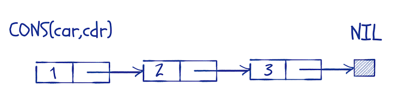
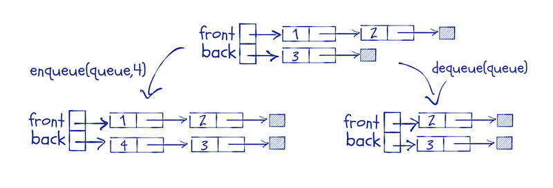
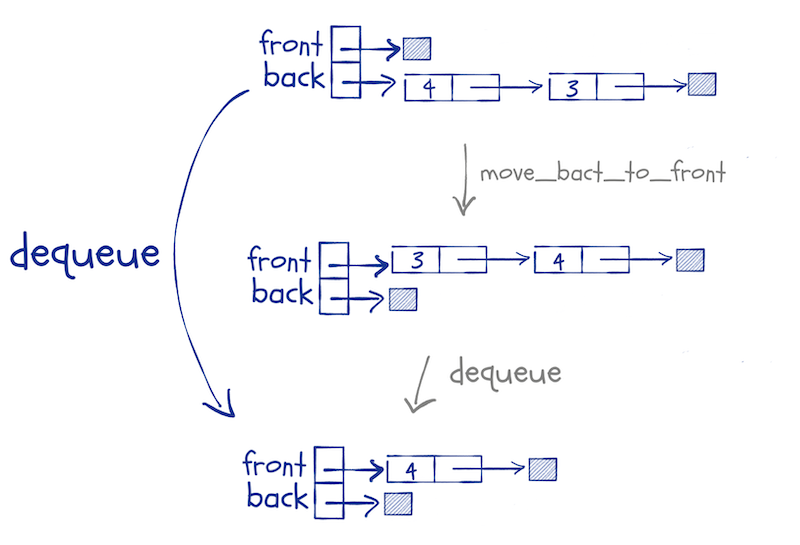
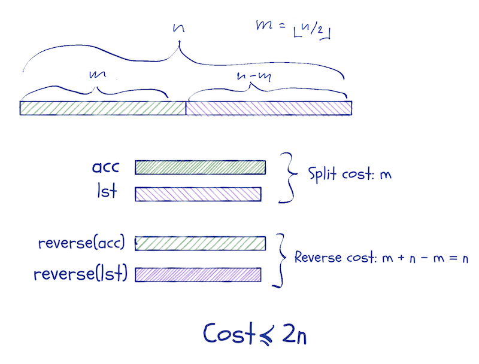

I wanted to write something about function parameters, how these are passed as so-called "promises", how these have associated scopes (and the consequences of that), and how they give us lazy evaluation.

It looks simple when you call a function, but a lot is going on.

While I was thinking about lazy evaluation, though, I tried to come up with an example where we could do something interesting with it, which made me think of lazy lists and lazy queues.

I wrote about those in [*Functional Data-Structures in R*](https://amzn.to/2QjSs9J), and I am not going to repeat all of it here, but I cannot resist using them as examples.

But I got sidetracked. When I wrote Functional Data-Structures, I hadn't thought about Haskell-like pattern matching in R. That kind of pattern matching makes it *a lot* easier to manipulate data structures. Without them, the code I wrote for Functional Data-Structures got a little hard to read.

Well, I implemented a pattern matching DSL in [*Domain-Specific Languages in R*](https://amzn.to/2QHMNLL). You can get the code [here](https://mailund.github.io/pmatch/). With this DSL, you can define data structures and then pattern match against them when you define functions.

I will include that library for this post:


```r
library(pmatch)
```

I will use patterns to define *linked lists*. Linked lists are more common in functional programming languages than the type of lists we have in R because most functional programming languages do not allow data to be modified. It is easy to build new linked lists from other lists efficiently, but there is not a lot you can do with vector-like lists if you cannot modify them.

R is a strange case when it comes to modifying data. All data is immutable, but you can modify environments, and sometimes that makes it look like you can modify data. That is an illusion. If you think this function will modify its input, you will be sadly disappointed.


```r
set_one <- function(x) x[1] <- 1
```

Inside the function body, we make a copy of `x` and assign to it. We never modify the original data.


```r
x <- rnorm(5)
x
```

```
## [1]  0.461919747  0.112770832  0.632319549 -1.240685729  0.008760227
```

```r
set_one(x)
x
```

```
## [1]  0.461919747  0.112770832  0.632319549 -1.240685729  0.008760227
```

Because data is immutable in R, you need data structures that you can update without modifying them. Those are called *functional data structures*.^[A caveat here. R is not a fast language, and there is overhead in the kind of functional programming I do in this post. There is overhead in using recursion instead of loops, and the pattern matching is not cheap either. If you need speed, you can do better than this. In pure R, you still need functional data structures, but if you have a need for speed, then maybe you should consider `Rcpp`.]

## Linked lists

A linked list is a recursive data structure. A list is either empty or consists of an element followed by a list. By tradition—something we inherit from the Lisp language—we call the empty list `nil`, and for a non-empty list, we call the head `car` and the tail `cdr`.

Using my pattern DSL, we can define linked lists this way:


```r
linked_list := NIL | CONS(car, cdr)
```

We define the data type `linked_list` as the result of the *constructors* `NIL` and `CONS`. The constructor for the empty list, `NIL` doesn't take any arguments but the constructor `CONS` takes two.

After we have defined the data structure, we can create lists using the constructors:


```r
llist <- CONS(1, CONS(2, CONS(3, NIL)))
llist
```

```
## CONS(car = 1, cdr = CONS(car = 2, cdr = CONS(car = 3, cdr = NIL)))
```

You can think of the list data structure as a head element, `car`, and then a pointer to a list, `cdr`.



That is how it is usually implemented, but since R doesn’t have pointers, the structure that `pmatch` makes is (an R) `list` with elements `car` and `cdr`. It behaves the same way, although less efficiently, of course. 

There is a default print method defined for all types you construct using `pmatch`, but I want a specialised one for lists to make them easier to read:


```r
toString.linked_list <- function(llist)
  cases(llist, NIL -> "[]",
        CONS(car, cdr) -> paste(car, "::", toString(cdr)))
print.linked_list <- function(llist)
  cat(toString(llist), "\n")

llist
```

```
## 1 :: 2 :: 3 :: []
```

This makes it a lot easier to read, especially long lists.

You can use `purrr` to construct longer lists if you want to. The constructors work just like functions. The `CONS` constructor takes its arguments in the wrong order for `reduce`, though, but a lambda expression fixes that:


```r
llist <- purrr::reduce_right(1:6, ~ CONS(.y,.x), .init = NIL)
llist
```

```
## 1 :: 2 :: 3 :: 4 :: 5 :: 6 :: []
```

A distinguishing property of linked lists is that we have constant time prepending. Adding a new head to a list doesn't modify the old list and in effect puts a pointer from a new head to an existing list. Unlike R `list`s, where changing a list often means making a complete copy—a linear time operation—prepending is always a constant time operation. The drawback is that most other operations take linear time. We don't have random access to a list's elements.

Creating constructors for data structures is not the only thing that `pmatch` lets us do. Much more importantly, it lets us match values against structures in a `switch`-like way.

You do this using the `cases` function. The syntax for testing different patterns against an object, `x`, is this:

```r
cases(x, patter1 -> result1, pattern2 -> result2, …)
```

The function takes a value made from data structure constructors as its first argument and then a sequence of pattern-result pairs. The patterns look like calls to constructors but test if `x` matches the structure in the pattern. If the pattern matches the structure, then the result of `cases` is what we get from result-expression. We can bind variables in the matching pattern and use that in the result expression. 

If you suspect that there is a lot of non-standard evaluation going on here, you are not wrong.

A simple example, reversing a list:


```r
reverse <- function(llist, acc = NIL)
  cases(llist,
        NIL -> acc,
        CONS(car, cdr) -> reverse(cdr, CONS(car, acc)))
```

This function recursively reverses a list. We use an accumulator, `acc` to do this. We go through each element in the input, prepending it to `acc`. When we reach the end of the list, `acc` will contain the input in reversed order.

In the `reverse` function, we match the input, `llist`, against two patterns. The pattern `NIL` will match empty strings, and the pattern `CONS(car, cdr)` will match non-empty lists (and assign the head and tail of those to the variables `car` and `cdr`).

When we see the empty list, we return `acc`—it should now contain the reversed list—and otherwise, we update `acc` and continue recursively.


```r
reverse(llist)
```

```
## 6 :: 5 :: 4 :: 3 :: 2 :: 1 :: []
```

We can illustrate the function this way:


Notice that the input list is not modified. We cannot do that. Instead, the parameter, `llist`, moves along it while we construct `acc`. If there is another reference to the original list, then the list it refers to isn’t changed; if there is not, the elements we scan past will be garbage-collected.

I won’t show the parts of structures that are not pointed to by variables in the figures below. I will use notation similar to this:


Another example could be concatenating two lists.


```r
concat <- function(l1, l2)
  cases(l1,
        NIL -> l2,
        CONS(car, cdr) -> CONS(car, concat(cdr, l2)))
concat(llist, llist)
```

```
## 1 :: 2 :: 3 :: 4 :: 5 :: 6 :: 1 :: 2 :: 3 :: 4 :: 5 :: 6 :: []
```

In this function, we also match against a list; in this case the first list, `l1`. We handle empty lists, and non-empty lists separate cases. For non-empty lists we, the match assigns the head and tail to variables `car` and `cdr` and construct a new list that consists of the head of `l1` and the result of concatenating `cdr` with `l2`.

We can draw the concatenation of `CONS(1, CONS(2, NIL))` and `CONS(3, CONS(4, CONS(5, NIL)))` like this:


We scan through `l1` as we move down the recursion and construct the new list as we return from it.

## Queues

If you want to implement queues, i.e. “first-in-first-out” structures, you cannot use the same structure as linked lists. You cannot extend lists from both ends.

If you use R lists, you are not better off. You still cannot modify them in functions, and you need to copy them every time you fake it, so they are of little help.

One trick that does work is to implement queues using two lists. You use two lists to represent the front and the back of the queue, respectively. When you enqueue an item, you prepend it to the back-list.

You have to prepend to make it a constant time operation, but we will remember to reverse the list before we dequeue elements. This means that we have to keep the front-list in the right order and the back-list in reverse order at all time.

We enqueue by adding an element to the head of the back-list, and we dequeue by taking the element at the head of the front-list. If the front-list is empty, we replace it with the reverse of the back queue.



We can define the queue structure as pairs of lists like this:


```r
queue := QUEUE(front, back)
```

and add a nicer print function, just as we did for lists:


```r
print.queue <- function(queue) {
  cat("Front:\t")
  print(queue$front)
  cat("Back:\t")
  print(queue$back)
}
```

I will use a convenience function for creating a new list and implement `enqueue` as I described above:


```r
new_queue <- function() QUEUE(NIL, NIL)
enqueue <- function(queue, x)
  cases(queue, QUEUE(front, back) -> QUEUE(front, CONS(x, back)))
```

The `enqueue` function can be used directly in a call to `purrr::reduce`, so we can construct a new queue this way:


```r
queue <- purrr::reduce(1:8, enqueue, .init = new_queue())
queue
```

```
## Front:	[] 
## Back:	8 :: 7 :: 6 :: 5 :: 4 :: 3 :: 2 :: 1 :: []
```

Moving the back-list to the front involves the list functions `reverse` and `concat` that we implemented above. We will use pattern matching to extract the two lists from a queue object, but otherwise, the movement is trivial to implement:


```r
move_back_to_front <- function(queue)
  cases(queue, QUEUE(front, back) -> QUEUE(concat(front, reverse(back)), NIL))

move_back_to_front(queue)
```

```
## Front:	1 :: 2 :: 3 :: 4 :: 5 :: 6 :: 7 :: 8 :: [] 
## Back:	[]
```

We invoke this function if we need to dequeue an element and the front-list is empty.



Now we can implement the `dequeue` function based on this. Usually, we would write a function for getting the element at the front of a queue and another for removing it; that is often the best design. That way, the first function would return an element from the queue and the second an updated queue.

However, if we take that approach, we would have to move elements from the back-list to the front-list twice to get the front element and update the list. The first function would have to update the lists before it can get the front element, and then it would throw away the updated lists. The second function would update the lists, throw away the front element and return the new queue.

It is better to combine the two operations in a single function that returns a pair—the front element and the updated queue. So, we define a type for pairs that we can use:


```r
pair := PAIR(first, second)
print.pair <- function(pair) {
  cat("First\n")
  print(pair$first)
  cat("Second:\n")
  print(pair$second)
}
```

Now, the `dequeue` function can be implemented like this:


```r
dequeue <- function(queue)
  cases(queue,
        QUEUE(NIL, NIL)        -> stop("Empty queue"),
        QUEUE(NIL, .)          -> dequeue(move_back_to_front(queue)),
        QUEUE(CONS(car, cdr), back) -> PAIR(car, QUEUE(cdr, back)))
```

We match the `queue` argument against three possibilities. The first is when it contains two empty lists. Then the queue is empty, and we shouldn’t try to dequeue any elements. If the front-list is empty, we construct a new queue from moving the back-list to the front-list, and then we call `dequeue` on the new lists.^[The `.` in patterns are used to match arbitrary expressions that we do not want to assign to variables.] Otherwise, we have a head and a tail of the front-list, we return the pair that contains the head and the queue where the head is removed.


```r
dequeue(queue)
```

```
## First
## [1] 1
## Second:
## Front:	2 :: 3 :: 4 :: 5 :: 6 :: 7 :: 8 :: [] 
## Back:	[]
```

To test the `queue` implementation, we can implement a function that builds a list from a queue. You can imagine a use for queues where you queue a number of elements to it and then want to iterate through them in the order you queued them but as a list. The function looks like this:


```r
queue_to_llist <- function(queue)
  cases(queue,
        QUEUE(NIL, NIL) -> NIL,
        otherwise ->
          cases(dequeue(queue),
                PAIR(x, q) -> CONS(x, queue_to_llist(q))))
```

The function is simple, once you get used to pattern matching and recursion. We match against an empty queue. When we see that, we return the empty list. Otherwise, we get the pair that is the result of dequeuing the first element. We construct a list that contains this front element at the head and with a tail that is a recursive call on the updated queue.

Evaluating it on the `queue` we defined earlier gives us this:


```r
queue_to_llist(queue)
```

```
## 1 :: 2 :: 3 :: 4 :: 5 :: 6 :: 7 :: 8 :: []
```

If you have no other use for queues, they give you a data structure where you can append elements in constant time.

Now, you might object that appending in constant time comes at a cost when you get the front of the queue. That requires copying elements from the back of the queue to the front. This is correct, but you get *amortised* constant time operations. If you imagine that each time you do a constant time operation, you also put one operation in the bank. Then, when the back-list is `n` long, you also have `n` operations in the bank, which can pay for its reversal.

## Deques

Double-ended queues, or `deques`, lets us add and take elements from both ends of the queue.^[For deques, please do *not* consult Functional Data-Structures in R. There are errors in that section. They cancelled out to give the right results, so my tests didn’t catch them, but the code does not have the right runtime complexity. I will make an errata for the book soon.]

Adding elements to the front instead of the back is trivial to implement. We just prepend to the `front` list instead of the `back` list:


```r
enqueue_front <- function(queue, x)
  cases(queue, QUEUE(front, back) -> QUEUE(CONS(x, front), back))
```

We can use this function exactly as the `enqueue` function from above.


```r
queue <- purrr::reduce(1:8, enqueue, .init = new_queue())
queue
```

```
## Front:	[] 
## Back:	8 :: 7 :: 6 :: 5 :: 4 :: 3 :: 2 :: 1 :: []
```

```r
queue <- purrr::reduce(1:8, enqueue_front, .init = new_queue())
queue
```

```
## Front:	8 :: 7 :: 6 :: 5 :: 4 :: 3 :: 2 :: 1 :: [] 
## Back:	[]
```

We can use the `dequeue` function from above to get the front element. I will rename it to `front`, though, to distinguish it from getting the last element; I will the function for that `back`.

We rename `dequeue` but otherwise nothing changes:


```r
front <- function(queue)
  cases(queue,
        QUEUE(NIL, NIL)        -> stop("Empty queue"),
        QUEUE(NIL, .)          -> front(move_back_to_front(queue)),
        QUEUE(CONS(car, cdr), back) -> PAIR(car, QUEUE(cdr, back)))
```

For the `back` function we need the reverse of `move_back_to_front`:


```r
move_front_to_back <- function(queue)
  cases(queue, QUEUE(front, back) -> QUEUE(NIL, concat(back, reverse(front))))

queue
```

```
## Front:	8 :: 7 :: 6 :: 5 :: 4 :: 3 :: 2 :: 1 :: [] 
## Back:	[]
```

```r
move_front_to_back(queue)
```

```
## Front:	[] 
## Back:	1 :: 2 :: 3 :: 4 :: 5 :: 6 :: 7 :: 8 :: []
```


```r
back <- function(queue)
  cases(queue,
        QUEUE(NIL, NIL)        -> stop("Empty queue"),
        QUEUE(., NIL)          -> back(move_front_to_back(queue)),
        QUEUE(front, CONS(car, cdr)) -> PAIR(car, QUEUE(front, cdr)))
```

We can write a function that translates a `deque` into a list in the opposite direction:


```r
reverse_queue_to_llist <- function(queue)
  cases(queue,
        QUEUE(NIL, NIL) -> NIL,
        otherwise ->
          cases(back(queue),
                PAIR(x, q) -> CONS(x, reverse_queue_to_llist(q))))
```

The `queue_to_llist` is the same as before.

One problem with this implementation is that the amortisation argument for the efficiency doesn't work. If you switch between calling `front` and `back`, you can end up moving elements between the two lists in each function call. Now the running time will be linear for each operation.

To fix this problem, we can move half the list that needs to be moved instead of the whole list. That way we avoid moving elements back and forth.

We need to know the length of the lists to make that work, and the easiest way to ensure this is store the lengths with the lists. We can update the definition of queues to this:


```r
queue := QUEUE(front_len, front, back_len, back)
# I need to redefine this since the construct :=
# defines a default that overwrites the one
# we defined above
print.queue <- function(queue) {
  cat("Front length:\t", queue$front_len, "\n")
  cat("Back length:\t", queue$back_len, "\n")
  cat("Front:\t")
  print(queue$front)
  cat("Back:\t")
  print(queue$back)
}
```


```r
new_queue <- function() QUEUE(0, NIL, 0, NIL)
enqueue <- function(queue, x)
  cases(queue,
        QUEUE(front_len, front, back_len, back) ->
          QUEUE(front_len, front, back_len + 1, CONS(x, back)))

enqueue_front <- function(queue, x)
  cases(queue,
        QUEUE(front_len, front, back_len, back) ->
          QUEUE(front_len + 1, CONS(x, front), back_len, back))

queue <- purrr::reduce(1:8, enqueue, .init = new_queue())
queue
```

```
## Front length:	 0 
## Back length:	 8 
## Front:	[] 
## Back:	8 :: 7 :: 6 :: 5 :: 4 :: 3 :: 2 :: 1 :: []
```

We can mostly use the `front` and `back` functions as they are, but not queue. The pattern for `QUEUE` objects now include the lengths, so we must take that into account. The changes are trivial, though, so I won't say more about them.


```r
front <- function(queue)
  cases(queue,
        QUEUE(., NIL, ., NIL)        -> stop("Empty queue"),
        QUEUE(., NIL, ., .)          -> front(move_back_to_front(queue)),
        QUEUE(front_len, CONS(car, cdr), back_len, back) ->
          PAIR(car, QUEUE(front_len - 1, cdr, back_len, back)))

back <- function(queue)
  cases(queue,
        QUEUE(., NIL, ., NIL)        -> stop("Empty queue"),
        QUEUE(., ., ., NIL)          -> back(move_front_to_back(queue)),
        QUEUE(front_len, front, back_len, CONS(car, cdr)) ->
          PAIR(car, QUEUE(front_len, front, back_len - 1, cdr)))
```

The real work in these functions is done in `move_front_to_back` and `move_back_to_front`. They need to only move *half* of the respective list. To split a list in two, we use this function:


```r
split_list <- function(lst, n, acc = NIL)
  cases(..(n, lst),
        ..(0, lst) -> PAIR(reverse(acc), lst),
        ..(n, CONS(car, cdr)) -> split_list(cdr, n - 1, CONS(car, acc)))

llist
```

```
## 1 :: 2 :: 3 :: 4 :: 5 :: 6 :: []
```

```r
split_list(llist, 3)
```

```
## First
## 1 :: 2 :: 3 :: [] 
## Second:
## 4 :: 5 :: 6 :: []
```

We haven't seen the `..` notation before, but it is part of the `pmatch` DSL. It allows us to match two patterns at the same time. Here, we want to match both the number at which to split, `n`, and the list. The function runs down the list, collecting the first part in an accumulator until we reach `n == 0`. Then we reverse the accumulator and return the pair.

We can modify the two movement functions to use it:


```r
move_front_to_back <- function(queue)
  cases(queue,
        QUEUE(front_len, front, 0, NIL) -> {
          n <- floor(front_len / 2)
          cases(split_list(front, n),
                PAIR(first, second) ->
                  QUEUE(n,
                        first,
                        front_len - n,
                        reverse(second)))
          })

move_back_to_front <- function(queue)
  cases(queue,
        QUEUE(0, NIL, back_len, back) -> {
          n <- floor(back_len / 2)
          cases(split_list(back, n),
                PAIR(first, second) ->
                  QUEUE(back_len - n, reverse(second), n, first))
        })
```

They are more complicated now, but mostly this is because we need to unpack the pairs we get from `split_list`. Otherwise, there is nothing complex in them.

If we want to make lists out of queues, we need to update the pattern match for the empty queue, but otherwise, there are no changes.


```r
queue_to_llist <- function(queue)
  cases(queue,
        QUEUE(0, NIL, 0, NIL) -> NIL,
        otherwise ->
          cases(front(queue),
                PAIR(x, q) -> CONS(x, queue_to_llist(q))))

reverse_queue_to_llist <- function(queue)
  cases(queue,
        QUEUE(0, NIL, 0, NIL) -> NIL,
        otherwise ->
          cases(back(queue),
                PAIR(x, q) -> CONS(x, reverse_queue_to_llist(q))))
```

Check the code out in action:


```r
queue <- purrr::reduce(1:8, enqueue, .init = new_queue())
queue
```

```
## Front length:	 0 
## Back length:	 8 
## Front:	[] 
## Back:	8 :: 7 :: 6 :: 5 :: 4 :: 3 :: 2 :: 1 :: []
```

```r
rev_queue <- purrr::reduce(1:8, enqueue_front, .init = new_queue())
rev_queue
```

```
## Front length:	 8 
## Back length:	 0 
## Front:	8 :: 7 :: 6 :: 5 :: 4 :: 3 :: 2 :: 1 :: [] 
## Back:	[]
```

```r
queue_to_llist(queue)
```

```
## 1 :: 2 :: 3 :: 4 :: 5 :: 6 :: 7 :: 8 :: []
```

```r
queue_to_llist(rev_queue)
```

```
## 8 :: 7 :: 6 :: 5 :: 4 :: 3 :: 2 :: 1 :: []
```

```r
reverse_queue_to_llist(queue)
```

```
## 8 :: 7 :: 6 :: 5 :: 4 :: 3 :: 2 :: 1 :: []
```

```r
reverse_queue_to_llist(rev_queue)
```

```
## 1 :: 2 :: 3 :: 4 :: 5 :: 6 :: 7 :: 8 :: []
```

The time analysis is similar to that of queues. You do not just pay for reversing a list this time, but also for splitting it. The cost of the split and reversal of a list of length `n`, however, is less than `2 n`:



We use a potential function that is `|f-b|` (the absolute difference in the length of the front- and the back-list). If every time we increase the potential, we put two operations in the bank, then we can pay for the split and reversal.

# Persistent and ephemeral data structures

In algorithmics, there is a distinction between *persistent* and *ephemeral* data structures. The first category consists of data structures that you can update, by which I mean make new copies of, without changing the input. Ephemeral are those where update operations have to change the original data structure. 

The queue and deque we have just implemented are persistent. This means that we can keep copies of them when we update them. If we keep a copy around in a state just before an expensive operation, we risk executing that operation more than once. The first time, we have operations in the bank to pay for it. The subsequent times we do not. That breaks the amortised running time.

You can get around this if you have lazy evaluation. Function arguments are evaluating lazily, and we can exploit that. But that is the topic of my next post.

<hr/>
<small>If you liked what you read, and want more like it, consider supporting me at [Patreon](https://www.patreon.com/mailund).</small>
<hr/>
