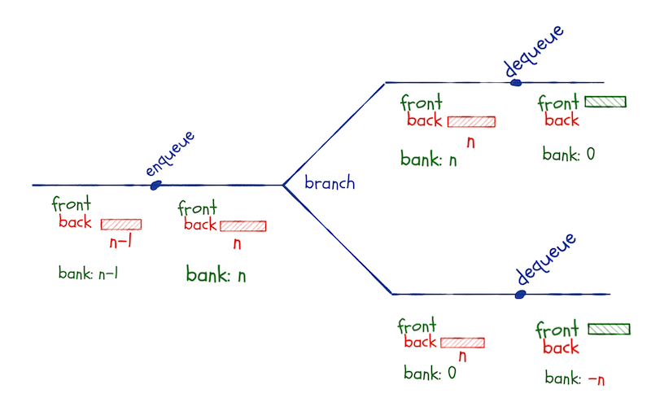
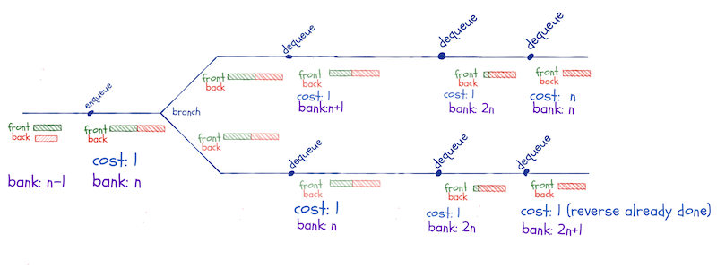
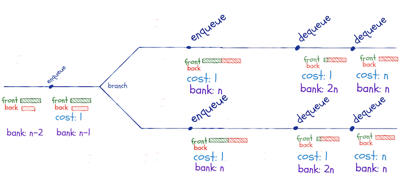
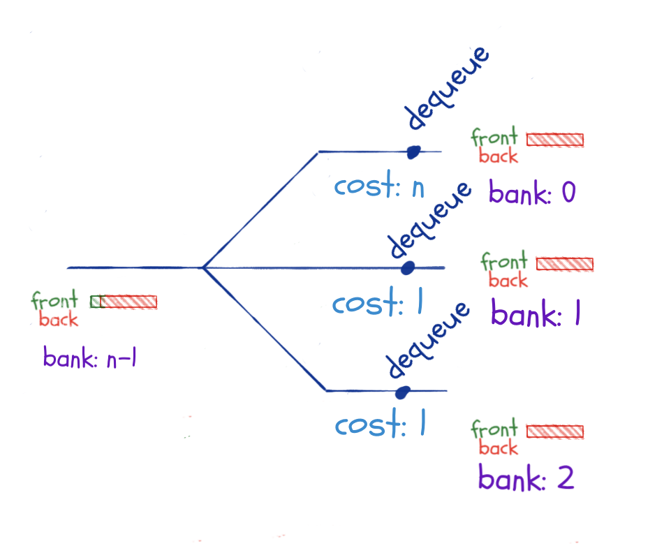

The purpose of the lazy lists I implemented in [my previous post](https://mailund.github.io/r-programmer-blog/2018/10/03/lazy-lists/) was to build lazy queues. Lazy lists give you constant time concatenation, which can be useful in itself, but I needed it to implement persistent functional queues.

In this post, I will use the linked list implementation I made earlier, but I will make a slight change to the lazy lists. It occurred to me, after publishing yesterday's post, that using the `CONS` constructor to return pairs from lazy-list thunks was not a good idea. The tail of a linked list should always be another linked list, and if I put a thunk there, it isn't.

With `pmatch` you can put type restrictions on constructors, and we can define a linked list where `cdr` is always another linked list, like this:

```r
linked_list := NIL | CONS(car, cdr : linked_list)
```

All the linked list code assumes that this is what a list looks like, and it is the assumption I broke in my previous post.

```{r list-definitions, echo=FALSE}
library(pmatch)

linked_list := NIL | CONS(car, cdr : linked_list)
toString.linked_list <- function(llist)
  cases(llist, NIL -> "[]",
        CONS(car, cdr) -> paste(car, "::", toString(cdr)))
print.linked_list <- function(llist)
  cat(toString(llist), "\n")

```

Instead of using `CONS` to return heads of a linked list, I will add another constructor, `LLCONS`. This isn't a lazy list constructor, I want those always to be empty or thunks, but it is what thunks should return.


```{r lazy-list-definitions}
lazy_list := LLNIL | THUNK(lst)
lazy_list_head := LLCONS(head, tail : lazy_list)
```

With this data structure definition, I need to update `lazy_cons` and the `lazy_macro` from the previous post, but all the other lazy functions remain the same.

```{r}
make_lazy_thunk <- function(expr) THUNK(function() expr)
lazy_cons  <- function(car, cdr) make_lazy_thunk(LLCONS(car, cdr))

lazy_macro <- function(empty_pattern, nonempty_pattern, ...) {
  
  empty_pattern    <- substitute(empty_pattern)
  nonempty_pattern <- substitute(nonempty_pattern)
  extra_args       <- rlang::enexprs(...)
  
  cases_pattern <- rlang::expr(
    cases(.list,
          LLNIL -> !!empty_pattern,
          THUNK(.list_thunk) ->
            cases(.list_thunk(),
                  LLCONS(car, cdr) -> !!nonempty_pattern))
  )
  function_expr <- rlang::expr(
    rlang::new_function(
      alist(.list =, !!!extra_args), 
      cases_pattern, 
      env = rlang::caller_env())  
  )
  
  rlang::eval_bare(function_expr)
}
```

```{r, echo=FALSE}
toString.lazy_list <- lazy_macro("<>", paste(car, ":: <...>"))
print.lazy_list <- function(x) cat(toString(x), "\n")

car <- lazy_macro(stop("Empty list"), car)
cdr <- lazy_macro(stop("Empty list"), cdr)

lazy_to_llist <- lazy_macro(NIL, CONS(car, lazy_to_llist(cdr)))
list_to_lazy_list <- function(lst, i = 1) {
  if (i > length(lst)) LLNIL
  else lazy_cons(lst[i], list_to_lazy_list(lst, i + 1))
}

lazy_concat  <- lazy_macro(second, lazy_cons(car, lazy_concat(cdr, second)), second =)

list_to_lazy_list <- function(lst, i = 1) {
  if (i > length(lst)) LLNIL
  else lazy_cons(lst[i], list_to_lazy_list(lst, i + 1))
}

```

```{r}
lazy_reverse <- lazy_macro(acc, lazy_reverse(cdr, lazy_cons(car, acc)), acc = LLNIL)
```

```{r}
x <- list_to_lazy_list(1:5)
lazy_to_llist(x)
y <- lazy_reverse(x)
lazy_to_llist(y)
```

## Lazy queues

Where [we left queues](https://mailund.github.io/r-programmer-blog/2018/10/01/lists-and-functional-queues/), we had a data structure with amortised constant time operations, but only as treated as an *ephemeral* structure.

By ephemeral data structures, we mean structures where some or all operations on them modify them. We cannot merely keep copies around in the state they have before an operation.

This is not the case for our functional queues. We do not ever modify them—they *are* persistent—but the runtime analysis will not work. If we keep copies around in a state where we have saved up for one expensive operation, and we then execute the expensive operations more than once.

I do not mean an `if-else` statement here. If we only take one of the two branches—as we would with an `if-else` statement—then the analysis works. We only have a problem if we keep a copy around, compute using the queue for a while, and then return to the copy and do more computations with it.

If, for example, we have inserted `n` elements into the queue—so these are all in the back-list—and then branch between two computational paths. In both paths, we dequeue an element. This triggers the reversal of the back-list, which costs `n` operations. We have money in the bank for the first of these, but in the second branch the bank is empty, and the reversal will put us in the red.



In a lazy queue, we will keep this invariant: The front-list must always be longer than the back-queue.

We will reverse the back-list every time it would get longer than the front-list. This can happen both in `enqueue` and `dequeue` operations.

This is different from the eager list, where we only reverse when we dequeue, but a lazy concatenation only cost one operation. The lazy-reversal is an O(n) operation—we cannot reverse linked lists faster than that—but we do not execute that operation until we need it. This doesn’t happen before we need to dequeue an element from it.

If we have 2n - 1 elements in the queue, n in the front-list and n-1 in the back-list, and we enqueue one more, we concatenate the reversed back-list to the front-list. If we then branch and dequeue along two computational paths, we won’t have to reverse the back-list until we have dequeued all the elements in the front-list.

If we pay one coin into the bank every time we do a constant time operation, we will have n coins in the bank (from enqueuing) when we do the concatenate-reverse operation. When we branch and dequeue until we need the reversal, we will have 2n in the bank before we reverse. The n coins we had before the concatenate-reversal and n from dequeuing from the front-list.

This operation leaves n coins in the bank. Along the second branch, we also need n dequeuing operations before we reverse, so we again have 2n in the bank when we reverse. This time the reversal is free—we have already reversed that queue, and with lazy evaluation, we remember the result.

We are not limited to two paths here. I have drawn two, but we can compute along as many branches as we wish. We will have more and more coins in the bank as long as we dequeue and do not pay more than once for the reversal.



There might be an "off by one" error or two in the accounting here, but it isn't all wrong, and I promise you that you can get it exactly right if you are more careful than I have been.

We cannot reuse reversals that are not part of the same concatenate-reversal operation. So, if we leave the enqueuing that triggers this operation until after we branch along the two computational paths, we do not gain anything from the lazy evaluation.

We still need to dequeue n times before we have to perform the expensive reversal, so along any alternative branches we compute, we save enough for the independent reversals.



What, then, if we branch just before we need the reversal. Here, we only have one dequeue operation before we trigger the reversal, so we do not save up n coins along the different branches.

That is true, but as long as the concatenate-reversal operation happens before we branch, the reversal is only executed once. So this scenario is not a problem either.



Keeping copies around and using them along different computational paths isn’t a problem. Either we do the concatenation-reversal operation before a branch, and then we get all reversal operations for the cost of one, or we save up for the reversal along each computational branch leading to the reversal.

We also have to satisfy the invariant when dequeuing, so if we had `enqueued` along one of the branches, we have had to add additional concatenation-reversals. Those, however, can be paid for with the coins we save when we perform the `enqueue` operations, so this isn't a problem for the time analysis either.

## Implementation

There are not many changes to the queue data structure to make it lazy. We need to replace the eager lists with lazy lists:

```{r}
queue := QUEUE(front_len, front, back_len, back)
new_queue <- function() QUEUE(0, LLNIL, 0, LLNIL)
```

```{r, echo=FALSE}
print.queue <- function(queue) {
  cat("Front length:\t", queue$front_len, "\n")
  cat("Back length:\t", queue$back_len, "\n")
  cat("Front:\t")
  print(queue$front)
  cat("Back:\t")
  print(queue$back)
}
```

I haven’t shown the `print` function, but it is the same as before. We delegate to `print.lazy_list` calls instead of `print.linked_list`, but that is handled by R’s generic function dispatch.

If the queue is empty, I put the first element added to the front instead of the queue. It ensures the invariant and is just common sense. I could also have done this for eager lists, but here I would technically have to reverse right after enqueueing, or I would violate the invariant.

```{r}
enqueue <- function(queue, x) {
  cases(queue,
        QUEUE(0, LLNIL, 0, LLNIL) -> 
          QUEUE(1, lazy_cons(x, LLNIL), 0, LLNIL),
        QUEUE(front_len, front, back_len, back) ->
          QUEUE(front_len, front, back_len + 1, lazy_cons(x, back)))
}
```

With lazy queues we do not have the problem with `purrr::reduce`. The call to `enqueue` creates a closure that keeps the variables we put in `lazy_cons`, so modifying variables in `reduce` doesn’t give us any problems.

```{r}
queue <- purrr::reduce(1:8, enqueue, .init = new_queue())
queue
lazy_to_llist(queue$front)
lazy_to_llist(queue$back)
```

We need to modify `enqueue` so it calls the concatenate-reversal operation 

```r
    lazy_concat(front, lazy_reverse(back))
```

when the back-list gets too long. It makes the function more complicated than the eager queue, but not substantially so.

```{r}
enqueue <- function(queue, x) {
  cases(queue,
        QUEUE(0, LLNIL, 0, LLNIL) -> 
          QUEUE(1, lazy_cons(x, LLNIL), 0, LLNIL),
        QUEUE(front_len, front, back_len, back) -> {
          if (back_len < front_len)
            QUEUE(front_len, front, back_len + 1, lazy_cons(x, back))
          else
            QUEUE(front_len + back_len, 
                  lazy_concat(front, lazy_reverse(back)),
                  1, 
                  lazy_cons(x, LLNIL))
        })
}
```

In action, building a queue looks like this:

```{r}
queue <- purrr::reduce(1:5, enqueue, .init = new_queue())
lazy_to_llist(queue$front)
lazy_to_llist(queue$back)
```

```{r}
queue <- purrr::reduce(1:9, enqueue, .init = new_queue())
lazy_to_llist(queue$front)
lazy_to_llist(queue$back)
```

The `dequeue` operation is also more complicated than for the eager queue. To get a value out of a list, we need to match a thunk and evaluate it. This is more complicated than before. Then we need to satisfy the invariant, which also adds complexity. The function looks like this:

```{r}
pair := PAIR(first, second)

dequeue <- function(queue) {
  cases(queue,
        QUEUE(0, LLNIL, 0, LLNIL) -> stop("Empty queue"),
        QUEUE(front_len, THUNK(front_thunk), back_len, back) -> {
          cases(front_thunk(),
                LLCONS(car, cdr) -> {
                  PAIR(
                    car,
                    if (back_len < front_len) QUEUE(front_len - 1, cdr, back_len, back)
                    else QUEUE(front_len + back_len - 1, 
                               lazy_concat(cdr, lazy_reverse(back)),
                               0,
                               LLNIL)
                  )
                }
            )
          }
        )
}

```

The `queue_to_llist` function looks like the one we had for the eager queue. The `dequeue` function is the new one, of course, but the function doesn't change:


```{r}
queue_to_llist <- function(queue)
  cases(queue,
        QUEUE(., LLNIL, ., LLNIL) -> NIL,
        otherwise ->
          cases(dequeue(queue),
                PAIR(x, q) -> CONS(x, queue_to_llist(q))))
```

```{r}
queue <- purrr::reduce(1:15, enqueue, .init = new_queue())
queue_to_llist(queue)
```

I hope you can see how lazy evaluation can sometimes be useful.


<hr/>
<small>If you liked what you read, and want more like it, consider supporting me at [Patreon](https://www.patreon.com/mailund).</small>
<hr/>
