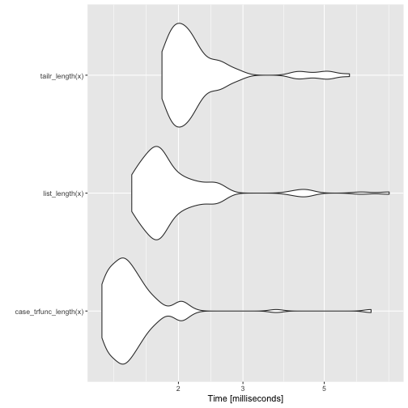
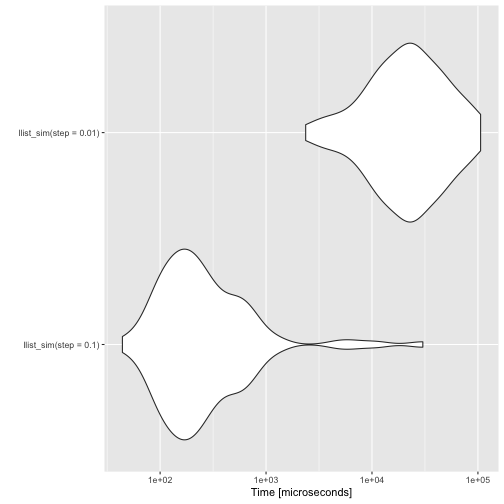
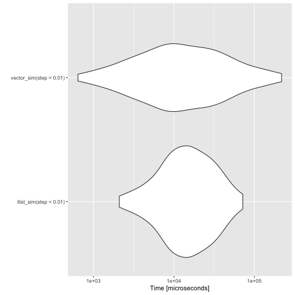
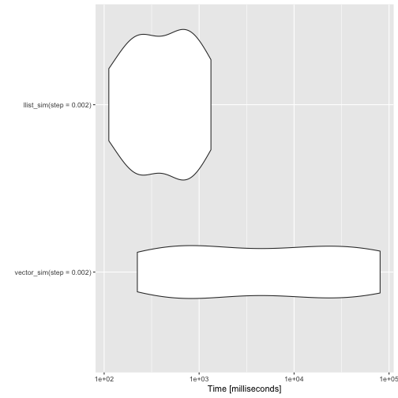

I'm still working on improving the speed of my pattern matching DSL. I have [improved the speed of constructors](https://mailund.github.io/r-programmer-blog/2018/10/16/the-cost-of-constructors/) and [pattern matching](https://mailund.github.io/r-programmer-blog/2018/10/18/the-cost-of-pattern-matching/), so now I wanted to get back to comparing vectors and linked lists.

Merely building a vector of fixed size by concatenating them is a silly example, so I'm choosing a different one here. Consider a situation where you are simulating a random walk until you hit one of two absorbing states, e.g. zero or one. In such a setup you do not necessarily know how many states you will see. You can allocate a vector you think is longer than what you would see, but that is risky. If you did not allocate a vector that is long enough, your simulation would crash. If your simulations run for hours, then that sucks. So appending to a vector might be better.

To simulate a random walk until you reach zero or one, you can write a function such as this.


```r
vector_sim <- function(start = 0.5, step) {
    states <- c()
    x <- start
    while (0 < x && x < 1) {
        states <- c(states, x)
        x <- rnorm(1, x, step)    
    }
    states
}
```

If your simulations reach an absorbing state quickly, then it doesn't take too long, but the quadratic running time (from copying vectors each time you concatenate) is costly as the walks get longer.


```r
benchmarks <- microbenchmark::microbenchmark(
    vector_sim(step = 0.1),
    vector_sim(step = 0.01)
)
print(benchmarks, order = "mean", unit = "relative")
```

```
## Unit: relative
##                     expr      min       lq     mean   median       uq
##   vector_sim(step = 0.1)  1.00000   1.0000   1.0000   1.0000   1.0000
##  vector_sim(step = 0.01) 95.54576 167.4517 109.4056 303.3932 335.9709
##       max neval
##   1.00000   100
##  23.52326   100
```


We can also implement the random walk using linked lists. Last time I looked at concatenation I only prepended to the list. To be fair to vectors, I also need to get the linked list in the right order. I can do that by reversing the list once the simulation is done.

Now, the construction of lists is costly compared to vector concatenation, but so is the pattern matching for reversing the list.


```r
library(pmatch)
llist := NIL | CONS(car, cdr)

llreverse <- case_trfunc(
    acc = NIL,
    NIL -> acc,
    CONS(car, cdr) -> Recall(cdr, CONS(car, acc))
)

llist_sim <- function(start = 0.5, step) {
    states <- NIL
    x <- start
    while (0 < x && x < 1) {
        states <- CONS(x, states)
        x <- rnorm(1, x, step)    
    }
    llreverse(states)
}
```

I implemented a new function for this application, `case_trfunc`. It implements the tail-recursion optimisation. Without that, we run out of recursion stack when the lists get long. Compared to the tail-recursion implementation I wrote for `tailr`, this version is fast. The functions you can write using `case_trfunc` are very limited compared to general R functions, but so is functions you can create using `case_func`, so you do not lose much if you use it. You have to use `Recall` for the recursion. When `case_trfunc` builds a function, it doesn't know what you will name it. In any case, using `Recall` is almost always a better idea if you can. That way, you can rename a function without modifying its body.

You can also use `tailr` to transform a tail recursive function into a loop. It is typically a little slower than the recursive version when you have sufficient stack space, though. The `case_trfunc` solution is faster.


```r
vector_to_list <- function(vec) {
    purrr::reduce_right(vec, ~ CONS(.y, .x), .init = NIL)
}

list_length <- case_func(
    acc = 0,
    NIL -> acc,
    CONS(car, cdr) -> list_length(cdr, acc + 1)
)

tailr_length <- tailr::loop_transform(list_length)

case_trfunc_length <- case_trfunc(
    acc = 0,
    NIL -> acc,
    CONS(car, cdr) -> Recall(cdr, acc + 1)
)

x <- vector_to_list(1:500)
bm <- microbenchmark::microbenchmark(
    case_trfunc_length(x), list_length(x), tailr_length(x)
)
print(bm, order = "mean", unit = "relative")
```

```
## Unit: relative
##                   expr      min       lq     mean   median       uq
##  case_trfunc_length(x) 1.000000 1.000000 1.000000 1.000000 1.000000
##         list_length(x) 1.206286 1.239162 1.323586 1.248527 1.304409
##        tailr_length(x) 1.458539 1.451368 1.514040 1.467512 1.501608
##        max neval
##  1.0000000   100
##  1.1204718   100
##  0.8730039   100
```

```r
autoplot(bm)
```



Back to the simulation example. The running time doesn't grow as fast for the linked list implementation as it does for the vector implementation. Not surprisingly, since one is a linear time algorithm while the other is a quadratic time algorithm.


```r
benchmarks <- microbenchmark::microbenchmark(
    llist_sim(step = 0.1),
    llist_sim(step = 0.01)
)
print(benchmarks, order = "mean", unit = "relative")
```

```
## Unit: relative
##                    expr      min       lq     mean   median       uq
##   llist_sim(step = 0.1)  1.00000  1.00000  1.00000   1.0000  1.00000
##  llist_sim(step = 0.01) 53.71984 87.15337 35.67568 110.4982 99.35948
##       max neval
##  1.000000   100
##  3.510323   100
```

```r
autoplot(benchmarks)
```



The vector solution is much faster than the linked list solution for short simulations, though. Unless I figure out a way to handle pattern matching in C, I won't be able to compete with built-in functions.


```r
benchmarks <- microbenchmark::microbenchmark(
    llist_sim(step = 0.01),
    vector_sim(step = 0.01)
)
print(benchmarks, order = "mean", unit = "relative")
```

```
## Unit: relative
##                     expr      min       lq      mean   median        uq
##   llist_sim(step = 0.01) 3.265975 1.678061 0.7271456 1.314104 0.8033132
##  vector_sim(step = 0.01) 1.000000 1.000000 1.0000000 1.000000 1.0000000
##        max neval
##  0.3294592   100
##  1.0000000   100
```

```r
autoplot(benchmarks)
```



For the linked lists to win, though, you have to increase the length of the simulations.


```r
benchmarks <- microbenchmark::microbenchmark(
    vector_sim(step = 0.002),
    llist_sim(step = 0.002),
    times = 10
)
print(benchmarks, order = "mean", unit = "relative")
```

```
## Unit: relative
##                      expr     min       lq     mean   median       uq
##   llist_sim(step = 0.002) 1.00000 1.000000  1.00000  1.00000  1.00000
##  vector_sim(step = 0.002) 1.99614 3.281817 40.59047 12.74987 40.11641
##       max neval
##   1.00000    10
##  60.45374    10
```

```r
autoplot(benchmarks)
```



I'm still not entirely satisfied with the pattern matching performance. To use it for algorithmic programming, it needs to be faster. It is never going to be as fast as implementing algorithms in `Rcpp`, but that is not what I am aiming for. I want to make it easier to implement data structures in pure R. That is, after all, easier than moving back and forward between C++ and R. Even if the `Rcpp` interface is exceptionally good for that.
