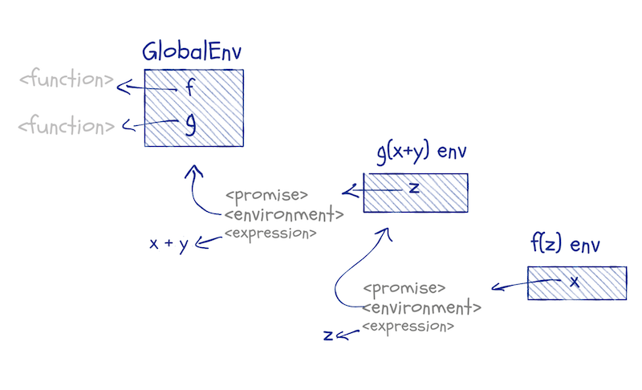
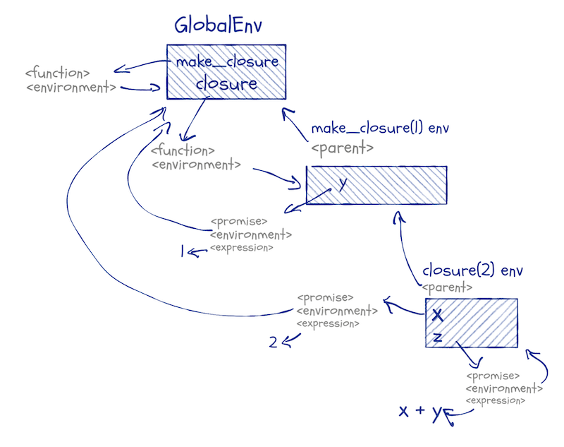

Have you ever wondered how functions are evaluated? How you can have arguments that would raise errors, but do not, or how default arguments can be expressions that depend on function arguments that you haven't seen yet when you define a function?

In essence, have you ever wondered how something like this works?


```r
f <- function(x, y, z = 2 * x) x + z
a <- b <- 1
f(a + b, stop("ARGH!!!"))
```

```
## [1] 6
```

We have a function, `f`, that takes three arguments. One of these has a default; the other two do not. We call it with two arguments; the first is the expression `a + b` and the other is an error message that throws an exception.

If you are familiar with languages that pass function arguments by value, you might be surprised to see that this doesn't give you an error. After all, you would expect the expression `stop("ARGH!!!")` to be evaluated before we call `f`, and that should give us an error. Clearly, that doesn't happen.

You might also wonder how the default argument, `z`, knows the value of `x`, that isn't provided until we call `f`. If you are familiar with default arguments in a language such as Python, this isn't what happens.

I have put this post in the category "Non-standard evaluation", but this is just because it fits into a series where the earlier posts cover non-standard evaluation. This post, however, is all about standard evaluation. Primarily, how function arguments are evaluated. And that is fascinating enough that we do not need any non-standard behaviour to spice it up.


## Function arguments are promises

Function arguments in R are passed as [*promises*](https://cran.r-project.org/doc/manuals/r-release/R-lang.html#Promise-objects). It is an unfortunate name, because promises is also a term used in concurrency and asynchronous communication, and these promises have nothing to do with that. 

In most R code, you never think about promises. You expect default parameters to work the way they do, and you might have run into lazy-evaluation issues with closures, but usually, arguments might as well have been passed by values. They are not, and this does have some consequences, and it is the reason the example above works the way it does.

When you call a function, R will translate the arguments into promise objects. These are expressions with an associated environment, not unlike functions and formulas that also have environments associated with them.

You can get the expression in a promise using `substitute`, and once you have the expression, you can evaluate it in any environment you wish. That is how non-standard evaluation works.

You cannot access the other components of a promise from base R. You can, however, if you use the `pryr` package.

Consider this function:


```r
f <- function(x) pryr::promise_info(x)
```

It returns a list that contains the components of the promise `x`:


```r
f(1)
```

```
## $code
## [1] 1
## 
## $env
## <environment: R_GlobalEnv>
## 
## $evaled
## [1] FALSE
## 
## $value
## NULL
```

```r
f(2 + 3)
```

```
## $code
## 2 + 3
## 
## $env
## <environment: R_GlobalEnv>
## 
## $evaled
## [1] FALSE
## 
## $value
## NULL
```

```r
f(x)
```

```
## $code
## x
## 
## $env
## <environment: R_GlobalEnv>
## 
## $evaled
## [1] FALSE
## 
## $value
## NULL
```

As you can see, the verbatim argument we give `f` is the expression in the promise. The environment is the global environment.

If we call `f` from another function, the promise in `x` will have a different environment; this will be the closure environment of the calling function:


```r
g <- function(z) {
  print(environment())
  f(z)
}
g(x + y)
```

```
## <environment: 0x7fd13ec7cac0>
```

```
## $code
## z
## 
## $env
## <environment: 0x7fd13ec7cac0>
## 
## $evaled
## [1] FALSE
## 
## $value
## NULL
```

A figure might be in order here, to show the structure of this example:



When we call `g(x + y)`, we create a promise for `g`'s `z` argument. This promise will have `x + y` as its expression and the global environment as its environment (because that is where we call `g` from). The variable `z` inside `g` refers to this promise. When we call `f(z)`, we create a promise inside `f` for its `x` argument. The expression it has is `z` (because we call `f(z)`, so `z` is the argument we give it). The environment the `x` promise has is the closure from the call to `g(x + y)`.

In this example, we only create promises. From `f` we return the information about one, but we never evaluate any promises. That only happens when we use a function argument in some expression.


## Evaluating promises

Until we look at a function argument, it only exists as a promise. The expression inside it can be any valid R expression, but it doesn't have to be something we can evaluate without getting an error. It can refer to variables that are not found in any environment we have access to, or it can be a `stop` call as in the initial example. It doesn't matter what it is until we evaluate it.

That happens when we use the promise in an expression.


```r
h <- function(x) {
  cat("Promise before evaluation:\n")
  print(pryr::promise_info(x))
  x
  cat("\nPromise after evaluation:\n")
  print(pryr::promise_info(x))
}
h(2 + 1)
```

```
## Promise before evaluation:
## $code
## 2 + 1
## 
## $env
## <environment: R_GlobalEnv>
## 
## $evaled
## [1] FALSE
## 
## $value
## NULL
## 
## 
## Promise after evaluation:
## $code
## 2 + 1
## 
## $env
## NULL
## 
## $evaled
## [1] TRUE
## 
## $value
## [1] 3
```

When we evaluate `x` in this example, we change the promise. We take the expression stored inside the promise, and we evaluate it in the environment that the promise carries with it. After we have evaluated the promise, it now contains the result of evaluating the expression. It loses its environment, but that has no interesting consequences; we do not need it any longer. Whenever we refer to the promise afterwards, we get the value it now contains.

There is a small twist on this rule, though. Expressions in R are function calls if they are any more complicated than literal values or variables, so when we use a promise in an expression, we might just be creating new promises in another function call. We can keep creating more and more promises without ever evaluating them.

Consider this:


```r
f <- function(x, y) x
g <- function(x, y) f(x, y) + 2
g(2, no_such_variable)
```

```
## [1] 4
```

This example gives us a value even though it uses a variable that is not defined anywhere. When we call `g`, the `no_such_variable` expression is put into the promise `y`. We use this promise when we call `f`, but `f` *doesn't* use it, `f`'s `y` promise is never evaluated. This means that `g`'s `y` promise isn't either, so everything works out ok.

In a chain of function calls, various promises can live in limbo until they are evaluated, and some might never be. If they are evaluated, though, they get a value, and we can use that value in other expressions.

In our code, we do not distinguish between promises and their values, because as soon as a promise is evaluated it in effect becomes its value. We do not have a special syntax to distinguish between promises and their values. But the difference between values and promises becomes apparent when expressions depend on environments that change.


## Lazy evaluation

We do not evaluate the expression inside a promise until we use the promise. This means that if we create a closure that contains it, it can sit unevaluated for a while. Consider this:


```r
make_thunk <- function(x) function() x
f <- make_thunk(x)
g <- make_thunk(x)
```

The promise `x` inside `make_thunk` is used as the body of a thunk^[A thunk is a function that doesn't take any arguments. They are a way of programming lazy evaluation, but they do not work exactly the same way that promises do.]. We do not evaluate that promise until the thunk is called, so when we create `f` and `g`, the promise is created but not evaluated. 

We do not have any global variable `x`, so if we try to evaluate one of the thunks, we get an error.


```r
f()
```

```
## Error in f(): object 'x' not found
```

This happens when the promise is evaluated. It will be evaluated in the global scope. That is the environment we associated with the promise when we called `make_thunk(x)` in the global scope. But it fails because there *is* no `x` to be found there.

If we define `x`, though, we can evaluate it.


```r
x <- 5
f()
```

```
## Warning in f(): restarting interrupted promise evaluation
```

```
## [1] 5
```

We get a warning here because the promise remembers that we had tried to evaluate it before, where we failed, but now we can, and we get a value.

We do not get a warning if we call `f` a second time.


```r
f()
```

```
## [1] 5
```

This is because the promise now remembers its value and it is not re-evaluated; the promise is now in effect just its value.

This also means that if we change `x`, it will not affect what we get when we call `f` again.


```r
x <- 7
f()
```

```
## [1] 5
```

The promise that is the body of the `f` thunk is already evaluated. It has the value 5. This value doesn't change just because the expression in the promise would have a different value if evaluated in the changed environment. We never evaluate promise-expressions twice. Once we have a value, we will always get that value.

We haven't evaluated the promise that is the body of the `g` thunk, though, so if we now call that function, we will evaluate the promise and get a new value. The evaluation works the same as for `f`. We evaluate the promise in the global environment to get a value. Evaluating `x` in the global environment now gives us 7.


```r
g()
```

```
## [1] 7
```

Now that both `f` and `g` contains promises with a value, changing the global environment no longer affects them.


```r
x <- 42
f()
```

```
## [1] 5
```

```r
g()
```

```
## [1] 7
```

If you write code where you update variables, this can bite you when you create closures. In pure functional languages, this isn't a problem. There you cannot modify variable-to-value bindings. But that is not how R works, so we have to deal with it.

A good rule of thumb is that you should never allow closures to contain unevaluated promises. If you return a function from a function call, you should make sure that all promises are evaluated first. You can do that using the `force` function.

If we add `force(x)` to the `make_thunk` function, like this:


```r
make_thunk <- function(x) {
  force(x)
  function() x
}
f <- make_thunk(x)
g <- make_thunk(x)
```

then the `x` inside the thunk-bodies is fixed at the value it has when we create the thunks. Modifying `x` afterwards will not change the promise:


```r
x <- 13
f()
```

```
## [1] 42
```

```r
g()
```

```
## [1] 42
```

The `force` function doesn't do anything. It is the identity function `function(x) x`. You could just as well define `make_thunk` like this:

```r
make_thunk <- function(x) {
  x
  function() x
}
```

Using `force` makes it explicit why you are evaluating the promise.

Forgetting to force a promise is such a common error that I often wish that it would be the default behaviour and we would need to explicitly delay evaluation of promises instead, but such behaviour would complicate the language. R would need to figure out which promises are remembered in closures and which are not. We do not want all promises evaluated, after all. That would happen in pass-by-value languages, but in R we permit arguments that are only conditionally evaluated. If we want to delay evaluation of some promises and not all, we have to be explicit about one of the two, and forcing promises is the most straightforward semantics because it doesn't require any analysis of expressions inside functions.

Anyway, on to the last thing you need to know to understand how function parameters work...


## Default arguments

When you define a function with default arguments, you do not evaluate the defaults. They are merely kept around as expressions. When you call the function, that is when you get promises. If you provide an argument for a default parameter, then you get the same promise as for variables that do not have defaults. If you rely on the defaults, then you still get a promise, but with a different environment.

Consider this example:


```r
f <- function(x, y = 2 * x) {
  cat("Promise x environment:\n")
  print(pryr::promise_info(x)$env)
  cat("\nPromise y environment:\n")
  print(pryr::promise_info(y)$env)
  cat("\nFunction call environment:\n")
  print(environment())
}
f(2 + 3)
```

```
## Promise x environment:
## <environment: R_GlobalEnv>
## 
## Promise y environment:
## <environment: 0x7fd14002cd10>
## 
## Function call environment:
## <environment: 0x7fd14002cd10>
```

When we call `f(2 + 3)`, we get two promises inside `f`. The first, `x`, is the expression `2 + 3`, that should be evaluated in the global environment. The second, `y`, is the expression `2 * x`, but the environment of this promise is the function-call's environment. Default arguments become promises, just as common arguments, but their environment is the one we execute the function body in.

This is why default arguments can be expressions that involve other arguments. They cannot evaluate those expressions before we call the function, but when we do call the function, those variables are in the function-call's environment, and the promises can see them.

Default arguments combine lexical scope and function-call scopes. They do not need any magic to do this; it just falls out of how environments work.

Consider this:


```r
make_closure <- function(y) {
  function(x, z = x + y) x + z
}
closure <- make_closure(1)
closure(2)
```

```
## [1] 5
```

When we define `make_closure`, we get a function, and this function has an associated environment. Here it is the global environment. When we call the function, we create a new environment and set its parent to the function's environment. We then create a new function, the inner function. That function's environment is the closure from the `make_closure` call. When we call the inner function, the closure, we create another function-call environment; its parent will be the one associated with the inner-function. When we evaluate the default promise inside this environment, we have access to local variables and any variables we can get to through the parent-chain of environments.




If this sounds like mumbo-jumbo to you, then you might want to read my [previous post on environments](https://mailund.github.io/r-programmer-blog/2018/09/20/scoping-rules-and-nse/).


## Deconstructing the example

Now we know everything to explain the initial example.

```r
f <- function(x, y, z = 2 * x) x + z
a <- b <- 1
f(a + b, stop("ARGH!!!"))
```

When we call `f` with arguments `a + b` and `stop("ARGH!!!")`, we create three promises: `x`, `y`, and `z`. The first contains the expression `a + b` and the global environment, the second the expression `stop("ARGH!!!")` and the global environment, and the third the expression `2 * x` and the function-call's environment. We do not evaluate the `y` promise, so we never call the `stop` function. We evaluate `x`, i.e. the expression `a + b` in the global scope and then we evaluate `z`, the expression `2 * x` in the function scope (where it can see `x`). That is how that worked.


## Explicitly making promises

This section is just a curiosity. You can create promises without involving function calls. You can, for example, create a promise, `x`, like this:


```r
delayedAssign("x", stop("Wait, what?"))
```

We have assigned to `x` an expression that raises an exception, but we do not *raise* the exception because the promise isn't evaluated. We have a promise.


```r
pryr::is_promise(x)
```

```
## [1] TRUE
```

If we evaluate `x`, it is evaluated like a promise (and in this case that means raising an error).


```r
x
```

```
## Error in eval(expr, envir, enclos): Wait, what?
```

With `delayedAssign` you can specify both the environment to evaluate the expression in and the environment the promise should be placed in.


```r
make_closure <- function(x) function() x + y + z
closure <- make_closure(2)
```

Here, I created a closure with an environment that contains the variable `x`.


```r
ls(environment(closure))
```

```
## [1] "x"
```

I can add a variable to that using `assign`, and that would evaluate the value I set the variable to.


```r
noisy <- function(x) {
  cat("I am", x, "\n")
  x
}
assign("y", noisy(2), envir = environment(closure))
```

```
## I am 2
```

```r
ls(environment(closure))
```

```
## [1] "x" "y"
```

If I use `delayedAssign`, however, I still add a variable to the environment, but I do not evaluate it yet.


```r
delayedAssign("z", noisy(3), assign.env = environment(closure))
ls(environment(closure))
```

```
## [1] "x" "y" "z"
```

The promise will be evaluated when I use it.


```r
closure()
```

```
## I am 3
```

```
## [1] 7
```

It is not evaluated the second time I use it; it is a promise and promises remember their values.


```r
closure()
```

```
## [1] 7
```

Be careful if you start messing around with `delayedAssign`. It is a power tool, and you should always be careful when you are using those.

## Teaser for my next post

The lazy evaluation of promises is often something you want to avoid. If you want to treat a function argument as a value, you should force it if you do not evaluate it; if it survives unevaluated in a closure, you might be in for unexpected behaviour.

But you *can* exploit promises to implement lazy evaluation of expressions. Not in the sense of lazy promises. Those come for free. But expressions where you delay evaluation until you need a value, then evaluate it once, and only once. With lazy evaluation, you can make persistent data structures that do not suffer from the problems I mentioned at the end of my [previous post](https://mailund.github.io/r-programmer-blog/2018/10/01/lists-and-functional-queues/). I will implement a lazy list and a lazy queue in my next post.

I hope to see you then.


<hr/>
<small>If you liked what you read, and want more like it, consider supporting me at [Patreon](https://www.patreon.com/mailund).</small>
<hr/>
