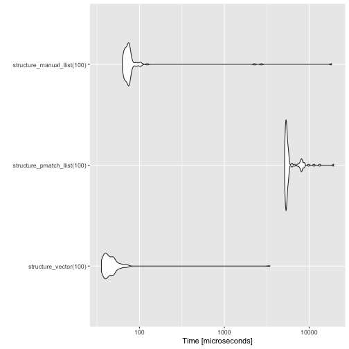
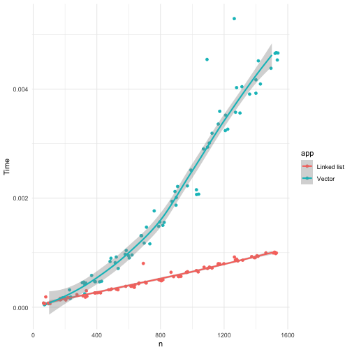
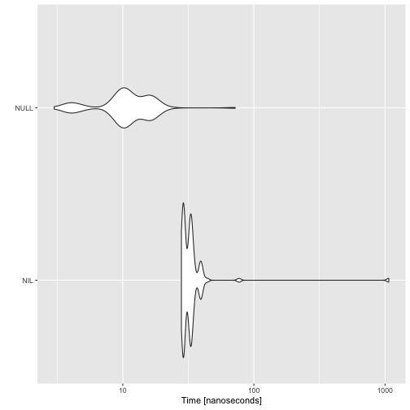
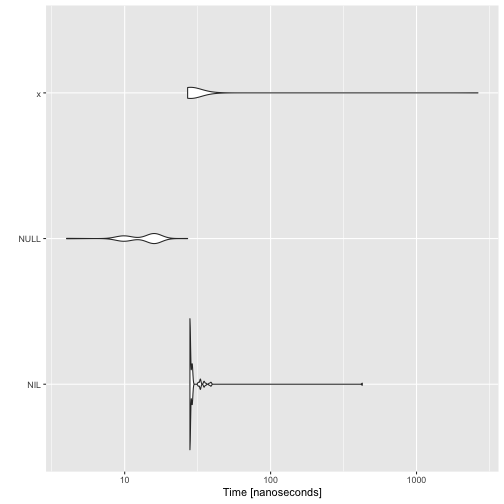
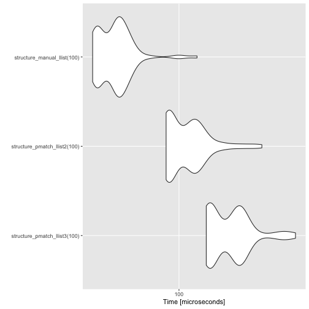

So, err, I wanted to compare the performance of linked lists versus R vectors on a case where the former is expected to perform better than the second: building a sequence one element at a time. If you work with vectors, whenever possible you want to allocate them to the size you are going to need. You cannot always do this, and if you find yourself having to add one element at a time by concatenation, you have a quadratic time performance on your hands.

In some cases, there are ways around this by being clever about allocation and reallocation, and that will give you a linear time algorithm. Using a linked list is more straightforward. You can add elements to the front of a list in constant time, so building a sequence using linked lists already takes linear time.

Programming a linked list in R, though, will not give you the performance that vectors have since operations on those are written in C. The performance gain you get from C implementations over R implementations will make vectors much faster for short sequences, but the better algorithm using linked list should soon outperform vectors.

I wanted to get a feeling for where the two lines, the vector and the linked list performance, would cross.

I got a nasty surprise.

Now, I know that linked lists will eventually be faster (and I tested it when I wrote about  [functional data-tructures](https://amzn.to/2QIDJWk)). It is still true, not surprisingly, and I got no shock about that.

The shock I got was how much of a performance penalty pattern matching gives me.

I wrote the `pmatch` package for [*Domain-Specific Languages in R*](https://amzn.to/2QHMNLL) as an example DSL. As a language, I think it is very nice, but now I have started *using* the language. So I wanted to redo the experiment comparing lists and vectors, only with lists created using `pmatch`.

I am also comparing to the linked list implementation from [*Functional Data Structures in R*](https://amzn.to/2QIDJWk), and growing a sequence one element at a time with the three different structures is implemented like this.


```r
structure_vector <- function(n) {
    i <- 1
    numbers <- c()
    while (i <= n) {
        numbers <- c(numbers, i)
        i <- i + 1
    }
}

library(pmatch)
llist := NIL | CONS(car, cdr : llist)

structure_pmatch_llist <- function(n) {
    i <- 1
    numbers <- NIL
    while (i <= n) {
        numbers <- CONS(i, numbers)
        i <- i + 1
    }
}

nil <- NULL
cons <- function(car, cdr) list(car = car, cdr = cdr)
structure_manual_llist <- function(n) {
    i <- 1
    numbers <- nil
    while (i <= n) {
        numbers <- cons(i, numbers)
        i <- i + 1
    }
}
```

When I compare their performance, it looks horrible.


```r
library(microbenchmark)
measures <- microbenchmark(
    structure_vector(100),
    structure_pmatch_llist(100),
    structure_manual_llist(100)
)
measures
```

```
## Unit: microseconds
##                         expr      min        lq      mean    median
##        structure_vector(100)   35.589   39.5215   79.4795   43.3035
##  structure_pmatch_llist(100) 5138.207 5311.5115 6141.8516 5433.3730
##  structure_manual_llist(100)   62.804   68.8670  306.2231   73.5315
##         uq       max neval
##    49.3005  3446.187   100
##  5708.5820 19428.017   100
##    77.6330 18371.577   100
```


```r
library(ggplot2)
autoplot(measures)
```



The `pmatch` implementation is orders of magnitude slower than the other two. The other linked list implementation is also slower than the vector implementation here, but that is because sequences of length 100 are too short for the linear time algorithm to outcompete the optimised implementation.

With the running time I get out of the `pmatch` implementation, I cannot move to much longer lists when benchmarking, so although I know that this implementation will eventually be faster than the vector solution, it would be for very large lists.

If we do look at longer lists, we can see that the (manually implemented) linked list soon outperforms the quadratic time vector solution.


```r
timeit <- function(f) {
    Vectorize(
        function(n) {
            times <- purrr::rerun(100, {
                then <- Sys.time()
                f(n)
                now <- Sys.time()
                now - then
            })
            mean(unlist(times))
        }
    )
}

ns <- rep(seq(100, 1500, by = 100), each = 5)
app_vector_times <- tibble::tibble(
    n = ns,
    app = "Vector",
    Time = timeit(structure_vector)(ns)
)
app_llist2_times <- tibble::tibble(
    n = ns,
    app = "Linked list",
    Time = timeit(structure_manual_llist)(ns)
)

library(magrittr)
rbind(app_vector_times, app_llist2_times) %>%
    ggplot(aes(x = n, y = Time, colour = app)) +
    geom_jitter() +
    geom_smooth(method = "loess") +
    theme_minimal()
```



I take the mean of 100 time measures to reduce the variance in the timing results. As you can see, even for the averaged times, there is a large variability in the time measures.

You can see that the linear time solution quickly outperforms the quadratic time solution, but what happens with the `pmatch` solution.

There is some overhead in using `NIL` instead of `NULL`. I am not sure why. Of course, `NULL` is one of the simplest objects in R and `NIL` holds some attributes, but if they are just moved around and not copied, I was expecting little if any additional cost to using `NIL`.


```r
autoplot(microbenchmark(NIL, NULL))
```



 It looks like that overhead is just part of having a variable.


```r
x <- list()
autoplot(microbenchmark(NIL, NULL, x))
```



I do need a variable. Otherwise, I cannot recognise when a constant is part of a pattern, and I cannot distinguish between two zero-arguments constructors.

In any case, where the running time is spent is in the constructor.


```r
microbenchmark(CONS(1, NIL), cons(1, NULL))
```

```
## Unit: nanoseconds
##           expr   min      lq     mean median      uq    max neval
##   CONS(1, NIL) 47090 47492.0 49183.05  47766 48176.5 134922   100
##  cons(1, NULL)   438   466.5   590.12    619   677.5   1466   100
```

The `CONS` constructor is orders of magnitude slower than `cons`. That is where the runtime penalty is coming from.

When you look at the function, you quickly see that it is vastly more complex than the `cons` function.


```r
CONS
```

```
## function (car, cdr) 
## {
##     args <- rlang::as_list(environment())
##     for (i in seq_along(args)) {
##         arg <- args[[constructor_arguments$arg[i]]]
##         type <- constructor_arguments$type[i]
##         if (!rlang::is_na(type) && !inherits(arg, type)) {
##             error_msg <- glue::glue("The argument {arg} is of type {class(arg)} ", 
##                 "but should be of type {type}.")
##             stop(simpleError(error_msg, call = match.call()))
##         }
##     }
##     structure(args, constructor = constructor_name, class = data_type_name)
## }
## <bytecode: 0x7ff91c18c240>
## <environment: 0x7ff91aba4ff8>
## attr(,"class")
## [1] "constructor" "function"
```

I wasn't thinking enough about performance when I wrote `pmatch`,^[I really should have thought about it, since obviously, it is for algorithmic programming it is most useful to have such a syntax.] so I just constructed a generic function that would work with all constructors instead of creating a function for a specific constructor.

## Building a new constructor

Now I think I should be able to take a constructor and build a function exactly for that. I will attempt to do that below.  There are some utility functions in `pmatch` that I won't repeat here, but `process_arguments` takes the arguments from the constructor. For a constructor such as `CONS(car, cdr : llist)` those would be `car` and `cdr`. The `cdr` argument has a type specification, and `process_arguments` will give me that as well. With this `CONS` contructor, I will get this tibble:

```r
# A tibble: 2 x 2
  arg   type  
  <chr> <chr> 
1 car   NA    
2 cdr   llist
```


The function that creates the constructor function takes three arguments, the constructor expression, the type we are defining, and the environment we need to put the constructor into. The first two are given as expressions. So, we can define the `CONS(car, cdr : llist)` constructor from the

```
llist := NIL | CONS(car, cdr : llist)
```

type definition using


```r
type_exp <- rlang::expr(llist)
constructor_exp <- rlang::expr(CONS2(car, cdr : llist))
```
```r
make_constructor_function(constructor_exp, type_exp, environment())
```

You do not need to assign the result of the function call to anything. The constructor is added to the environment provided, as does a function for printing the data type.

In the new function I create a constructor, but now I use metaprogramming to put the value creation inside the function instead of analysing the structure at runtime. I also replaced a call to `structure` with code for explicitly setting the class and the attribute I need for pattern matching. Because that turned out to be much faster.



There is still a lot of code in the function, but with this version, it is run when the constructor is created and not when it is called.


```r
make_constructor_function <- function(constructor, data_type_name, env) {
    constructor_name <- rlang::quo_name(constructor[[1]])
    constructor_arguments <- process_arguments(constructor[-1])

    # there is a bit of code involved here, but it doesn't matter
    # if it is slow. What matters is that the constructor is not.
    vars <- constructor_arguments$arg
    list_expr <- setNames(rlang::exprs(!!!rlang::syms(vars)), vars)

    no_typechecks <- 0
    typechecks <- list()
    for (i in seq_along(constructor_arguments)) {
        arg <- constructor_arguments[i,]
        if (!is.na(arg$type)) {
            var <- rlang::sym(arg$arg)
            type <- arg$type

            err_msg <- glue::glue(
                "The argument {var} should be of type {type}."
            )

            ex <- rlang::expr(
                if (!inherits(!!var, !!type))
                    stop(simpleError(!!err_msg, call = match.call()))
            )
            typechecks <- c(typechecks, ex)
            no_typechecks <- no_typechecks + 1
        }
    }
    length(typechecks) <- no_typechecks

    # create the constructor function
    func_args <- replicate(length(vars), rlang::missing_arg())
    names(func_args) <- vars
    body <- rlang::expr({
        !!!typechecks
        args <- !!list_expr
        class(args) <- !!data_type_name
        attr(args, "constructor") <- !!constructor_name
        args
    })
    constructor <- rlang::new_function(
        func_args, body, env
    )

    # set meta information about the constructor
    class(constructor) <- c("constructor", "function")

    # put the constructor in the binding scope
    assign(constructor_name, constructor, envir = env)
}
```

I didn't add the printing function here. It is the same as earlier and I didn't want to complicate the function.

The `:=` syntax still uses the old function, I haven't changed the implementation of the operator after all, so I have to create the constructors manually. I make one with a type specification and another without, to get a measure of the runtime cost of checking a type.


```r
make_constructor_function(
    rlang::expr(CONS2(car, cdr)),
    "llist",
    environment()
)
make_constructor_function(
    rlang::expr(CONS3(car, cdr : llist)),
    "llist",
    environment()
)

CONS2
```

```
## function (car, cdr) 
## {
##     args <- list(car = car, cdr = cdr)
##     class(args) <- "llist"
##     attr(args, "constructor") <- "CONS2"
##     args
## }
## attr(,"class")
## [1] "constructor" "function"
```

```r
CONS3
```

```
## function (car, cdr) 
## {
##     if (!inherits(cdr, "llist")) 
##         stop(simpleError("The argument cdr should be of type llist.", 
##             call = match.call()))
##     args <- list(car = car, cdr = cdr)
##     class(args) <- "llist"
##     attr(args, "constructor") <- "CONS3"
##     args
## }
## attr(,"class")
## [1] "constructor" "function"
```

Now I can add the two new constructors to my performance tests.


```r
structure_pmatch_llist2 <- function(n) {
    i <- 1
    numbers <- NIL
    while (i <= n) {
        numbers <- CONS2(i, numbers)
        i <- i + 1
    }
}

structure_pmatch_llist3 <- function(n) {
    i <- 1
    numbers <- NIL
    while (i <= n) {
        numbers <- CONS3(i, numbers)
        i <- i + 1
    }
}
```

As you can see, the new constructors are much faster.


```r
measures <- microbenchmark(
    structure_pmatch_llist(100),
    structure_pmatch_llist3(100),
    structure_pmatch_llist2(100),
    structure_manual_llist(100)
)
autoplot(measures)
```


Manually creating the list structure is still faster, but not frighteningly so. 


```r
measures <- microbenchmark(
    structure_pmatch_llist3(100),
    structure_pmatch_llist2(100),
    structure_manual_llist(100)
)
autoplot(measures)
```



There is still some overhead to using patterns for type construction, but that is hard to avoid.

Now, as you can imagine, there is also a lot of overhead in matching types with the `cases` function, but I think I can speed that up as well. I'm working on it.

