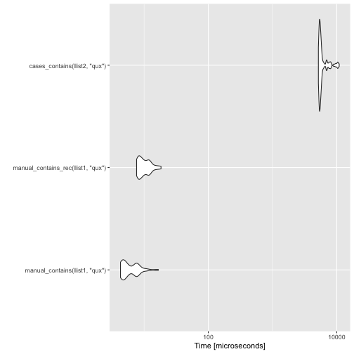
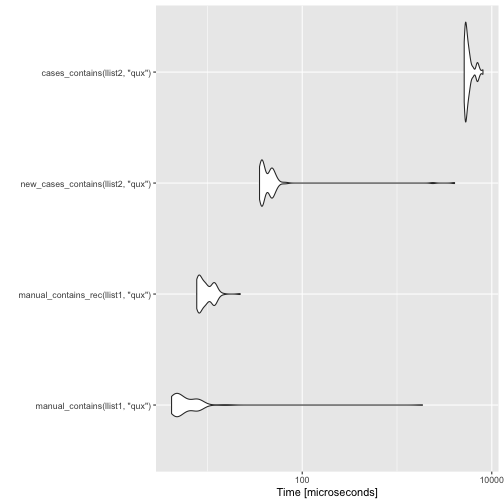
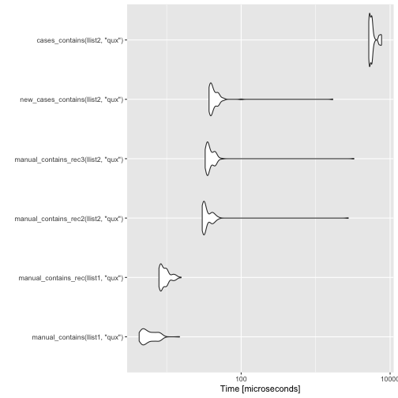

Following up on [my previous post](https://mailund.github.io/r-programmer-blog/2018/10/16/the-cost-of-constructors/), where I figured out to improve the speed of constructors, I will have a look at pattern matching in this post.

I haven't added any of this to [`pmatch`](https://mailund.github.io/pmatch/) yet. The new constructors shouldn't change the interface, but the new pattern matching will. I am not sure if anyone is using `pmatch` except for myself, but I need to figure out the best way to deprecate the `cases` function.

Anyway, to remind you, I was looking at linked lists and comparing the runtime performance of manually defined lists, and lists created using `pmatch`'s pattern mechanism. I defined them like this:


```r
library(pmatch)
llist := NIL | CONS(car, cdr : llist)

nil <- NULL
cons <- function(car, cdr) list(car = car, cdr = cdr)
```

For my experiments, I made two lists of length ten like this.


```r
llist1 <- purrr::reduce(1:10, ~ cons(.y, .x), .init = nil)
llist2 <- purrr::reduce(1:10, ~ CONS(.y, .x), .init = NIL)
```

Now, for the pattern matching experiments, I have made these two functions for the manual lists. The first uses a look and the second a recursive function. They check if an element is in a list.


```r
manual_contains <- function(llist, key) {
    while (!is.null(llist)) {
        if (llist$car == key) return(TRUE)
        llist <- llist$cdr
    }
    FALSE
}

manual_contains_rec <- function(llist, key) {
    if (is.null(llist))
        FALSE
    else if (llist$car == key)
        TRUE
    else
        manual_contains_rec(llist$cdr, key)
}
```

There is a slight overhead with using recursion rather than iteration, but it is minor, as you can see.


```r
measures <- microbenchmark::microbenchmark(
    manual_contains(llist1, "qux"),
    manual_contains_rec(llist1, "qux")
)
print(measures, order = "mean", unit = "relative")
```

```
## Unit: relative
##                                expr      min       lq     mean   median
##      manual_contains(llist1, "qux") 1.000000 1.000000 1.000000 1.000000
##  manual_contains_rec(llist1, "qux") 1.827843 1.811431 1.051072 1.810764
##        uq       max neval
##  1.000000 1.0000000   100
##  1.787733 0.9150948   100
```

For the `pmatch` defined lists I need to use recursion, and the version you can define with the current `pmatch` package will look like this.


```r
cases_contains <- function(llist, key) {
    cases(llist,
          NIL -> FALSE,
          CONS(car, cdr) ->
              if (car == key) TRUE else cases_contains(cdr, key))
}
```

The `cases` function does the pattern matching, and it is a complex function.


```r
body(cases)
```

```
## {
##     matchings <- rlang::quos(...)
##     for (i in seq_along(matchings)) {
##         eval_env <- rlang::get_env(matchings[[i]])
##         match_expr <- rlang::quo_expr(matchings[[i]])
##         assert_correctly_formed_pattern_expression(match_expr)
##         switch(as.character(match_expr[[1]]), `<-` = {
##             test_expr <- match_expr[[3]]
##             result_expr <- match_expr[[2]]
##         }, `~` = {
##             test_expr <- match_expr[[2]]
##             result_expr <- match_expr[[3]]
##         }, stop(paste0("Unexpected pattern call to ", match_expr[[1]])))
##         match <- test_pattern_(expr, test_expr, eval_env)
##         if (!rlang::is_null(match)) {
##             return(rlang::eval_tidy(result_expr, data = match, 
##                 env = eval_env))
##         }
##     }
##     error_msg <- glue::glue("None of the patterns matched the expression.")
##     stop(simpleError(error_msg, call = match.call()))
## }
```

I'm only showing the body of the function here. It has some attributes set on it that are not relevant for this post, so I don't want to confuse anyone by showing those.

Not surprisingly, the complexity of `cases` makes the pattern matching solution inefficient, compared to the manual list implementations.


```r
measures <- microbenchmark::microbenchmark(
    manual_contains(llist1, "qux"),
    manual_contains_rec(llist1, "qux"),
    cases_contains(llist2, "qux")
)
print(measures, order = "mean", unit = "relative")
```

```
## Unit: relative
##                                expr        min          lq       mean
##      manual_contains(llist1, "qux")    1.00000    1.000000   1.000000
##  manual_contains_rec(llist1, "qux")    1.77946    1.798424   1.639486
##       cases_contains(llist2, "qux") 1206.09152 1162.114878 958.776294
##       median         uq        max neval
##     1.000000   1.000000   1.000000   100
##     1.781626   1.541775   1.099892   100
##  1027.055751 763.920431 655.117270   100
```

```r
ggplot2::autoplot(measures)
```



The pattern matching syntax is convenient when working with data structures, but with this runtime penalty, you probably do not want to use it. Three orders of magnitude in the runtime is not a small matter, after all.

So, as I did in the previous post, my goal now is to replace the generic pattern matching mechanism with functions that check the patterns for a specific usage rather than handle general cases. I show the code at the bottom of the post. It is complicated, but the complex code runs when you define a function that uses pattern matching and not when you use it.


Since the new code creates a function, I can't call it inside another function. I now use a `case_func` function to define a pattern matching function.

As a simple example, consider the `factorial` function. You define it like this.


```r
factorial <- case_func(
    acc = 1,
    1 -> acc,
    n -> factorial(n - 1, acc * n)
)
```

It should be easy to understand how this defines the function.

The result is this:


```r
factorial
```

```
## function (.match_expr, acc = 1) 
## if ({
##     1 == .match_expr
## }) acc else if ({
##     n <- .match_expr
##     TRUE
## }) factorial(n - 1, acc * n) else {
##     stop("None of the patterns match.")
## }
```

This actual function is not as easy to read, but that is not the point. The point is that it works as intended.


```r
factorial(4)
```

```
## [1] 24
```

It shouldn't be a problem to set the `"srcref"` attribute to print the function the way it is defined, but I haven't done that yet.

Another function, one for computing the length of a list, will look like this.


```r
llength <- case_func(
    acc = 0,
    NIL -> acc,
    CONS(., cdr) -> llength(cdr, acc + 1)
)
llength
```

```
## function (.match_expr, acc = 0) 
## if (is.na(.match_expr) && attr(.match_expr, "constructor") == 
##     "NIL") acc else if (all("CONS" == attr(.match_expr, "constructor"), 
##     {
##         . <- .match_expr$car
##         TRUE
##     }, {
##         cdr <- .match_expr$cdr
##         TRUE
##     })) llength(cdr, acc + 1) else {
##     stop("None of the patterns match.")
## }
```

```r
llength(llist2)
```

```
## [1] 10
```

Getting back to the performance experiments, we can define the function for checking if a list contains a given key like this.


```r
new_cases_contains <- case_func(
    key,
    NIL -> FALSE,
    CONS(car, cdr) ->
        if (car == key) TRUE else new_cases_contains(cdr, key)
)
```

The definition doesn't look that different from the one based on `cases`, but it is much more efficient.


```r
measures <- microbenchmark(
    manual_contains(llist1, "qux"),
    manual_contains_rec(llist1, "qux"),
    new_cases_contains(llist2, "qux"),
    cases_contains(llist2, "qux")
)
print(measures, unit = "relative", order = "mean")
```

```
## Unit: relative
##                                expr         min         lq        mean
##  manual_contains_rec(llist1, "qux")    1.843690    1.77460   0.3993522
##      manual_contains(llist1, "qux")    1.000000    1.00000   1.0000000
##   new_cases_contains(llist2, "qux")    8.473231    8.22288   4.3482793
##       cases_contains(llist2, "qux") 1222.680210 1152.69001 234.2519871
##       median         uq        max neval
##     1.735374   1.495477 0.01194299   100
##     1.000000   1.000000 1.00000000   100
##     7.438342   6.143125 2.18196629   100
##  1030.461423 754.479646 4.34811620   100
```

```r
ggplot2::autoplot(measures)
```



There is a performance penalty for using pattern matching, but it comes down to checking if the base case is the `NIL` constructor or `NULL`.


```r
manual_contains_rec2 <- function(llist, key) {
    # NIL test
    if (is.na(llist) && attr(llist, "constructor") == "NIL")
        FALSE
    else if (llist$car == key)
        TRUE
    else
        manual_contains_rec2(llist$cdr, key)
}
```

If we only check for the base cases, this would be all we need, but in general, we need to check if the input is constructed from the right `pmatch` constructor, so we would need a function like this in the general case.


```r
manual_contains_rec3 <- function(llist, key) {
    # NIL test
    if (is.na(llist) && attr(llist, "constructor") == "NIL")
        FALSE
    else if (attr(llist, "constructor") == "CONS") {
        if (llist$car == key)
            TRUE
        else
            manual_contains_rec3(llist$cdr, key)
    }
}
```

A benchmark of all the functions looks like this.


```r
measures <- microbenchmark(
    manual_contains(llist1, "qux"),
    manual_contains_rec(llist1, "qux"),
    manual_contains_rec2(llist2, "qux"),
    manual_contains_rec3(llist2, "qux"),
    new_cases_contains(llist2, "qux"),
    cases_contains(llist2, "qux")
)
print(measures, unit = "relative", order = "mean")
```

```
## Unit: relative
##                                 expr         min          lq       mean
##       manual_contains(llist1, "qux")    1.000000    1.000000   1.000000
##   manual_contains_rec(llist1, "qux")    1.844658    1.728561   1.589451
##    new_cases_contains(llist2, "qux")    8.673149    7.970208   9.905225
##  manual_contains_rec2(llist2, "qux")    7.028116    6.455053  10.280640
##  manual_contains_rec3(llist2, "qux")    7.696111    7.215579  11.735784
##        cases_contains(llist2, "qux") 1212.198922 1098.871315 961.855584
##       median         uq        max neval
##     1.000000   1.000000   1.000000   100
##     1.670901   1.447464   1.050333   100
##     7.374195   6.751162 114.289348   100
##     5.844207   5.668979 184.539331   100
##     6.549769   6.192762 219.477020   100
##  1014.411578 829.846792 516.467263   100
```

```r
ggplot2::autoplot(measures)
```



There is still a heavy price to pay for pattern matching, but for more complex data structures, where you cannot merely access list items, you do need something more complicated than the manual list implementations. If that is the case, then I don't think this overhead is too costly a price to pay for the ease of use that pattern matching gives you.

I don't know if I can get more performance out of the pattern matching solutions. I am not sure how I could move some of the code to C/C++, but it might be possible. When I have added this solution to the `pmatch` package, I might look into that.

## Transformation code

```r
func_constructor_test <- function(pattern_expr, nesting, eval_env) {
    if (rlang::is_call(pattern_expr)) {
        name <- rlang::as_string(pattern_expr[[1]])
        constructor <- get(name, eval_env)

        constructor_vars <- names(formals(constructor))

        if (!rlang::is_null(constructor) && inherits(constructor, "constructor")) {

            test_exprs <- rlang::expr(
                !!name == attr(!!nesting, "constructor")
            )

            for (i in 2:length(pattern_expr)) {
                var <- rlang::sym(constructor_vars[i - 1])
                nesting_nesting <- call("$", nesting, var)
                test_exprs <- c(
                    test_exprs,
                    transform_match(
                        pattern_expr[[i]],
                        nesting_nesting,
                        eval_env
                ))
            }
            return(as.call(c(quote(all), test_exprs)))
        }
    }
    NULL
}

const_constructor_test <- function(pattern_expr, nesting, eval_env) {
    # Is it a constructor?
    if (rlang::is_symbol(pattern_expr) &&
        exists(rlang::as_string(pattern_expr), eval_env)) {

        name <- rlang::as_string(pattern_expr)
        val <- get(name, eval_env)
        val_constructor <- attr(val, "constructor_constant")

        if (!rlang::is_null(val_constructor)) {
            # We have a constructor but is it the actual constant?
            if (val_constructor == name) {
                test_expr <- rlang::expr(
                    is.na(!!nesting) && attr(!!nesting, "constructor") == !!name
                )
                return(test_expr)
            }
        }
    }

    NULL
}

const_test <- function(pattern_expr, nesting, eval_env) {

    # This function *must* be tested after the const constructor test
    if (rlang::is_atomic(pattern_expr)) {
        rlang::expr({
            !!pattern_expr == !!nesting
        })
    } else {
        NULL
    }
}

var_test <- function(pattern_expr, nesting, eval_env) {

    # This function *must* be tested after the const constructor test
    if (rlang::is_symbol(pattern_expr)) {
        rlang::expr({
            !!pattern_expr <- !!nesting
            TRUE
        })
    } else {
        NULL
    }
}


transform_match <- function(pattern_expr, nesting, eval_env) {

    test_funcs <- c(
        func_constructor_test,
        const_constructor_test,
        const_test,
        var_test
    )
    for (func in test_funcs) {
        test <- func(pattern_expr, nesting, eval_env)
        if (!rlang::is_null(test)) {
            return(test)
        }
    }
    stop(glue::glue("Malformed pattern {pattern_expr}"))
}

case_func <- function(...) {

    matchings <- rlang::quos(...)
    func_args <- c()
    eval_env <- rlang::caller_env()

    match_cases <- rlang::expr({
        stop("None of the patterns match.")
    })
    for (i in rev(seq_along(matchings))) {
        match_expr <- rlang::quo_expr(matchings[[i]])
        if (rlang::is_symbol(match_expr)) {
            x <- list(rlang::missing_arg())
            names(x) <- rlang::as_string(match_expr)
            func_args <- c(func_args, x)
            next
        }
        # the order of test and result depend on the syntax... for `->` the
        # R parser will switch the two; for `~` it will not.
        switch(as.character(match_expr[[1]]),
               "<-" = {
                   pattern_expr <- match_expr[[3]]
                   eval_expr <- match_expr[[2]]
               },
               "~" = {
                   eval_expr <- match_expr[[2]]
                   pattern_expr <- match_expr[[3]]
               },
               # not a pattern, make it an argument
               {
                   func_args <- c(func_args, matchings[i])
                   next # not a pattern
               }
        )

        match_cases <-
            call("if",
                 transform_match(pattern_expr, quote(.match_expr), eval_env),
                 eval_expr,
                 match_cases)
    }

    func_args <- lapply(func_args, rlang::quo_squash)
    func_args <- c(list(.match_expr = rlang::missing_arg()), func_args)
    rlang::new_function(
        func_args,
        match_cases,
        eval_env
    )
}
```
